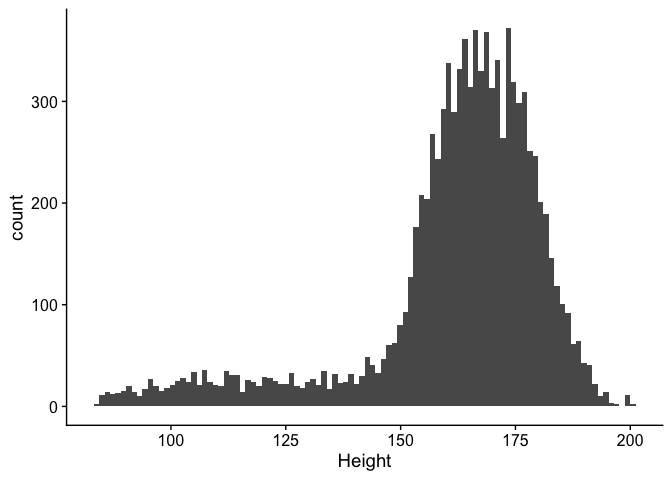
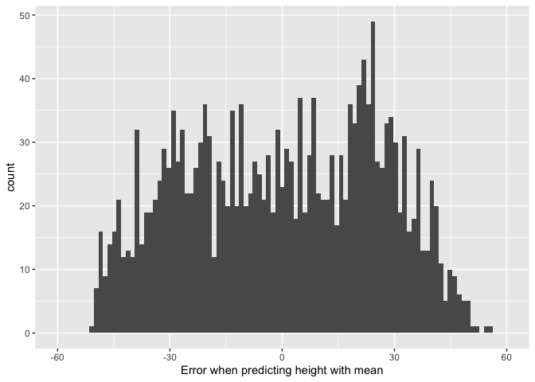
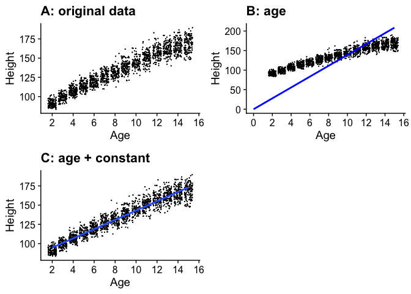
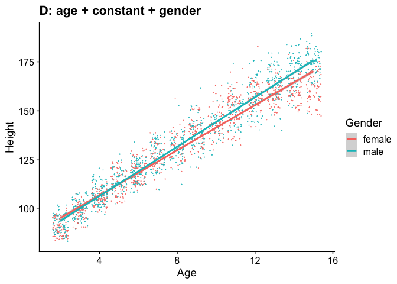
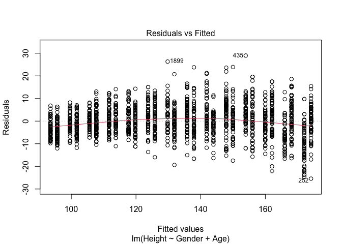
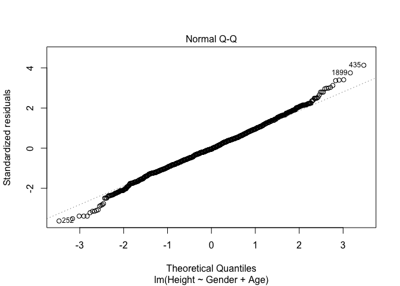
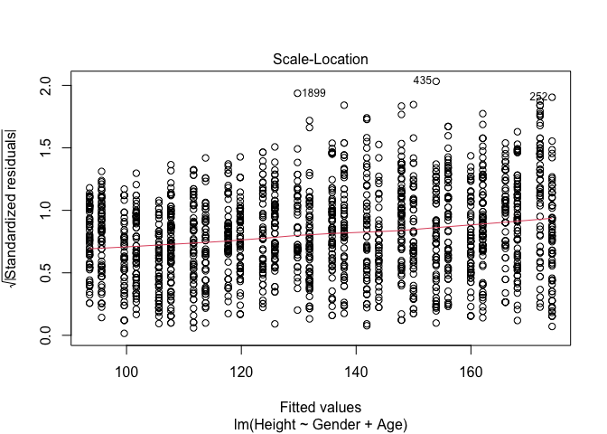
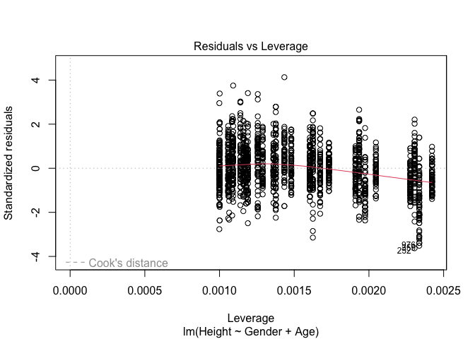
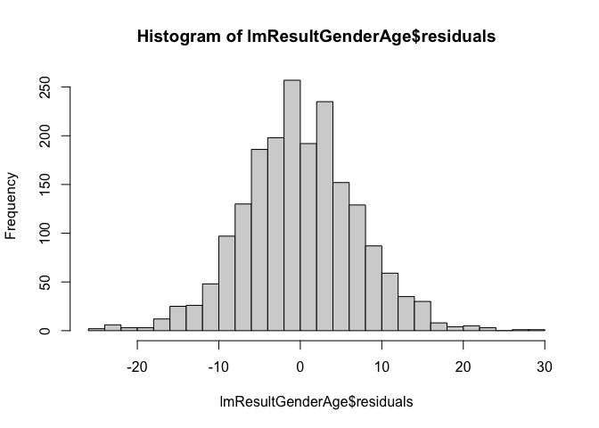

Lab 03
================
Ken Field

## NHANES Dataset

Data from the US National Health and Nutrition Examination Study
<https://www.cdc.gov/nchs/nhanes/index.htm>

This is survey data collected by the US National Center for Health
Statistics (NCHS) which has conducted a series of health and nutrition
surveys since the early 1960’s. Since 1999 approximately 5,000
individuals of all ages are interviewed in their homes every year and
complete the health examination component of the survey. The health
examination is conducted in a mobile examination center (MEC).

A description of the variables can be found in the package description.

``` r
data("NHANES")
summary(NHANES)
```

    ##        ID           SurveyYr       Gender          Age          AgeDecade   
    ##  Min.   :51624   2009_10:5000   female:5020   Min.   : 0.00    40-49 :1398  
    ##  1st Qu.:56904   2011_12:5000   male  :4980   1st Qu.:17.00    0-9   :1391  
    ##  Median :62160                                Median :36.00    10-19 :1374  
    ##  Mean   :61945                                Mean   :36.74    20-29 :1356  
    ##  3rd Qu.:67039                                3rd Qu.:54.00    30-39 :1338  
    ##  Max.   :71915                                Max.   :80.00   (Other):2810  
    ##                                                               NA's   : 333  
    ##    AgeMonths          Race1           Race3               Education   
    ##  Min.   :  0.0   Black   :1197   Asian   : 288   8th Grade     : 451  
    ##  1st Qu.:199.0   Hispanic: 610   Black   : 589   9 - 11th Grade: 888  
    ##  Median :418.0   Mexican :1015   Hispanic: 350   High School   :1517  
    ##  Mean   :420.1   White   :6372   Mexican : 480   Some College  :2267  
    ##  3rd Qu.:624.0   Other   : 806   White   :3135   College Grad  :2098  
    ##  Max.   :959.0                   Other   : 158   NA's          :2779  
    ##  NA's   :5038                    NA's    :5000                        
    ##       MaritalStatus         HHIncome     HHIncomeMid        Poverty     
    ##  Divorced    : 707   more 99999 :2220   Min.   :  2500   Min.   :0.000  
    ##  LivePartner : 560   75000-99999:1084   1st Qu.: 30000   1st Qu.:1.240  
    ##  Married     :3945   25000-34999: 958   Median : 50000   Median :2.700  
    ##  NeverMarried:1380   35000-44999: 863   Mean   : 57206   Mean   :2.802  
    ##  Separated   : 183   45000-54999: 784   3rd Qu.: 87500   3rd Qu.:4.710  
    ##  Widowed     : 456   (Other)    :3280   Max.   :100000   Max.   :5.000  
    ##  NA's        :2769   NA's       : 811   NA's   :811      NA's   :726    
    ##    HomeRooms       HomeOwn             Work          Weight      
    ##  Min.   : 1.000   Own  :6425   Looking   : 311   Min.   :  2.80  
    ##  1st Qu.: 5.000   Rent :3287   NotWorking:2847   1st Qu.: 56.10  
    ##  Median : 6.000   Other: 225   Working   :4613   Median : 72.70  
    ##  Mean   : 6.249   NA's :  63   NA's      :2229   Mean   : 70.98  
    ##  3rd Qu.: 8.000                                  3rd Qu.: 88.90  
    ##  Max.   :13.000                                  Max.   :230.70  
    ##  NA's   :69                                      NA's   :78      
    ##      Length          HeadCirc         Height           BMI       
    ##  Min.   : 47.10   Min.   :34.20   Min.   : 83.6   Min.   :12.88  
    ##  1st Qu.: 75.70   1st Qu.:39.58   1st Qu.:156.8   1st Qu.:21.58  
    ##  Median : 87.00   Median :41.45   Median :166.0   Median :25.98  
    ##  Mean   : 85.02   Mean   :41.18   Mean   :161.9   Mean   :26.66  
    ##  3rd Qu.: 96.10   3rd Qu.:42.92   3rd Qu.:174.5   3rd Qu.:30.89  
    ##  Max.   :112.20   Max.   :45.40   Max.   :200.4   Max.   :81.25  
    ##  NA's   :9457     NA's   :9912    NA's   :353     NA's   :366    
    ##     BMICatUnder20yrs         BMI_WHO         Pulse           BPSysAve    
    ##  UnderWeight:  55    12.0_18.5   :1277   Min.   : 40.00   Min.   : 76.0  
    ##  NormWeight : 805    18.5_to_24.9:2911   1st Qu.: 64.00   1st Qu.:106.0  
    ##  OverWeight : 193    25.0_to_29.9:2664   Median : 72.00   Median :116.0  
    ##  Obese      : 221    30.0_plus   :2751   Mean   : 73.56   Mean   :118.2  
    ##  NA's       :8726    NA's        : 397   3rd Qu.: 82.00   3rd Qu.:127.0  
    ##                                          Max.   :136.00   Max.   :226.0  
    ##                                          NA's   :1437     NA's   :1449   
    ##     BPDiaAve          BPSys1          BPDia1           BPSys2     
    ##  Min.   :  0.00   Min.   : 72.0   Min.   :  0.00   Min.   : 76.0  
    ##  1st Qu.: 61.00   1st Qu.:106.0   1st Qu.: 62.00   1st Qu.:106.0  
    ##  Median : 69.00   Median :116.0   Median : 70.00   Median :116.0  
    ##  Mean   : 67.48   Mean   :119.1   Mean   : 68.28   Mean   :118.5  
    ##  3rd Qu.: 76.00   3rd Qu.:128.0   3rd Qu.: 76.00   3rd Qu.:128.0  
    ##  Max.   :116.00   Max.   :232.0   Max.   :118.00   Max.   :226.0  
    ##  NA's   :1449     NA's   :1763    NA's   :1763     NA's   :1647   
    ##      BPDia2           BPSys3          BPDia3       Testosterone    
    ##  Min.   :  0.00   Min.   : 76.0   Min.   :  0.0   Min.   :   0.25  
    ##  1st Qu.: 60.00   1st Qu.:106.0   1st Qu.: 60.0   1st Qu.:  17.70  
    ##  Median : 68.00   Median :116.0   Median : 68.0   Median :  43.82  
    ##  Mean   : 67.66   Mean   :117.9   Mean   : 67.3   Mean   : 197.90  
    ##  3rd Qu.: 76.00   3rd Qu.:126.0   3rd Qu.: 76.0   3rd Qu.: 362.41  
    ##  Max.   :118.00   Max.   :226.0   Max.   :116.0   Max.   :1795.60  
    ##  NA's   :1647     NA's   :1635    NA's   :1635    NA's   :5874     
    ##    DirectChol       TotChol         UrineVol1       UrineFlow1     
    ##  Min.   :0.390   Min.   : 1.530   Min.   :  0.0   Min.   : 0.0000  
    ##  1st Qu.:1.090   1st Qu.: 4.110   1st Qu.: 50.0   1st Qu.: 0.4030  
    ##  Median :1.290   Median : 4.780   Median : 94.0   Median : 0.6990  
    ##  Mean   :1.365   Mean   : 4.879   Mean   :118.5   Mean   : 0.9793  
    ##  3rd Qu.:1.580   3rd Qu.: 5.530   3rd Qu.:164.0   3rd Qu.: 1.2210  
    ##  Max.   :4.030   Max.   :13.650   Max.   :510.0   Max.   :17.1670  
    ##  NA's   :1526    NA's   :1526     NA's   :987     NA's   :1603     
    ##    UrineVol2       UrineFlow2     Diabetes     DiabetesAge        HealthGen   
    ##  Min.   :  0.0   Min.   : 0.000   No  :9098   Min.   : 1.00   Excellent: 878  
    ##  1st Qu.: 52.0   1st Qu.: 0.475   Yes : 760   1st Qu.:40.00   Vgood    :2508  
    ##  Median : 95.0   Median : 0.760   NA's: 142   Median :50.00   Good     :2956  
    ##  Mean   :119.7   Mean   : 1.149               Mean   :48.42   Fair     :1010  
    ##  3rd Qu.:171.8   3rd Qu.: 1.513               3rd Qu.:58.00   Poor     : 187  
    ##  Max.   :409.0   Max.   :13.692               Max.   :80.00   NA's     :2461  
    ##  NA's   :8522    NA's   :8524                 NA's   :9371                    
    ##  DaysPhysHlthBad  DaysMentHlthBad  LittleInterest   Depressed   
    ##  Min.   : 0.000   Min.   : 0.000   None   :5103   None   :5246  
    ##  1st Qu.: 0.000   1st Qu.: 0.000   Several:1130   Several:1009  
    ##  Median : 0.000   Median : 0.000   Most   : 434   Most   : 418  
    ##  Mean   : 3.335   Mean   : 4.127   NA's   :3333   NA's   :3327  
    ##  3rd Qu.: 3.000   3rd Qu.: 4.000                                
    ##  Max.   :30.000   Max.   :30.000                                
    ##  NA's   :2468     NA's   :2466                                  
    ##   nPregnancies       nBabies         Age1stBaby    SleepHrsNight   
    ##  Min.   : 1.000   Min.   : 0.000   Min.   :14.00   Min.   : 2.000  
    ##  1st Qu.: 2.000   1st Qu.: 2.000   1st Qu.:19.00   1st Qu.: 6.000  
    ##  Median : 3.000   Median : 2.000   Median :22.00   Median : 7.000  
    ##  Mean   : 3.027   Mean   : 2.457   Mean   :22.65   Mean   : 6.928  
    ##  3rd Qu.: 4.000   3rd Qu.: 3.000   3rd Qu.:26.00   3rd Qu.: 8.000  
    ##  Max.   :32.000   Max.   :12.000   Max.   :39.00   Max.   :12.000  
    ##  NA's   :7396     NA's   :7584     NA's   :8116    NA's   :2245    
    ##  SleepTrouble PhysActive  PhysActiveDays       TVHrsDay        CompHrsDay  
    ##  No  :5799    No  :3677   Min.   :1.000   2_hr     :1275   0_to_1_hr:1409  
    ##  Yes :1973    Yes :4649   1st Qu.:2.000   1_hr     : 884   0_hrs    :1073  
    ##  NA's:2228    NA's:1674   Median :3.000   3_hr     : 836   1_hr     :1030  
    ##                           Mean   :3.744   0_to_1_hr: 638   2_hr     : 589  
    ##                           3rd Qu.:5.000   More_4_hr: 615   3_hr     : 347  
    ##                           Max.   :7.000   (Other)  : 611   (Other)  : 415  
    ##                           NA's   :5337    NA's     :5141   NA's     :5137  
    ##  TVHrsDayChild   CompHrsDayChild Alcohol12PlusYr   AlcoholDay    
    ##  Min.   :0.000   Min.   :0.000   No  :1368       Min.   : 1.000  
    ##  1st Qu.:1.000   1st Qu.:0.000   Yes :5212       1st Qu.: 1.000  
    ##  Median :2.000   Median :1.000   NA's:3420       Median : 2.000  
    ##  Mean   :1.939   Mean   :2.198                   Mean   : 2.914  
    ##  3rd Qu.:3.000   3rd Qu.:6.000                   3rd Qu.: 3.000  
    ##  Max.   :6.000   Max.   :6.000                   Max.   :82.000  
    ##  NA's   :9347    NA's   :9347                    NA's   :5086    
    ##   AlcoholYear    SmokeNow    Smoke100         Smoke100n       SmokeAge    
    ##  Min.   :  0.0   No  :1745   No  :4024   Non-Smoker:4024   Min.   : 6.00  
    ##  1st Qu.:  3.0   Yes :1466   Yes :3211   Smoker    :3211   1st Qu.:15.00  
    ##  Median : 24.0   NA's:6789   NA's:2765   NA's      :2765   Median :17.00  
    ##  Mean   : 75.1                                             Mean   :17.83  
    ##  3rd Qu.:104.0                                             3rd Qu.:19.00  
    ##  Max.   :364.0                                             Max.   :72.00  
    ##  NA's   :4078                                              NA's   :6920   
    ##  Marijuana   AgeFirstMarij   RegularMarij  AgeRegMarij    HardDrugs  
    ##  No  :2049   Min.   : 1.00   No  :3575    Min.   : 5.00   No  :4700  
    ##  Yes :2892   1st Qu.:15.00   Yes :1366    1st Qu.:15.00   Yes :1065  
    ##  NA's:5059   Median :16.00   NA's:5059    Median :17.00   NA's:4235  
    ##              Mean   :17.02                Mean   :17.69              
    ##              3rd Qu.:19.00                3rd Qu.:19.00              
    ##              Max.   :48.00                Max.   :52.00              
    ##              NA's   :7109                 NA's   :8634               
    ##  SexEver         SexAge      SexNumPartnLife   SexNumPartYear   SameSex    
    ##  No  : 223   Min.   : 9.00   Min.   :   0.00   Min.   : 0.000   No  :5353  
    ##  Yes :5544   1st Qu.:15.00   1st Qu.:   2.00   1st Qu.: 1.000   Yes : 415  
    ##  NA's:4233   Median :17.00   Median :   5.00   Median : 1.000   NA's:4232  
    ##              Mean   :17.43   Mean   :  15.09   Mean   : 1.342              
    ##              3rd Qu.:19.00   3rd Qu.:  12.00   3rd Qu.: 1.000              
    ##              Max.   :50.00   Max.   :2000.00   Max.   :69.000              
    ##              NA's   :4460    NA's   :4275      NA's   :5072                
    ##       SexOrientation  PregnantNow  
    ##  Bisexual    : 119   Yes    :  72  
    ##  Heterosexual:4638   No     :1573  
    ##  Homosexual  :  85   Unknown:  51  
    ##  NA's        :5158   NA's   :8304  
    ##                                    
    ##                                    
    ## 

``` r
help(NHANES)
```

Several of the variables are categorical. Let’s convert them into
factors all at once so they are handled by R properly. We will learn a
better way to do this in the future, but for now this will work.

``` r
NHANES <- as.data.frame(unclass(NHANES), stringsAsFactors=TRUE)
```

## Model of Height Data

First look at the entire data set.

``` r
ggplot(NHANES) +
  aes(x = Height) +
  geom_histogram(bins=100) +
  theme_cowplot()
```

    ## Warning: Removed 353 rows containing non-finite values (`stat_bin()`).

<!-- -->

Now lets just look at the data for children aged 2-15. Also drop any row
that has NA for Height.

``` r
NHANES_child <- filter(NHANES, (Age >= 2 & Age <= 15))
NHANES_child <- drop_na(NHANES_child, Height)
ggplot(NHANES_child) +
  aes(x = Height) +
  geom_histogram(bins=100) +
  theme_cowplot()
```

<!-- -->

## Model of the data

First, we will test to see if a simple model of using mean +- standard
deviation can predict the height of children.

``` r
mean(NHANES_child$Height)
```

    ## [1] 134.0911

``` r
sd(NHANES_child$Height)
```

    ## [1] 25.74176

``` r
summary(NHANES_child$Height)
```

    ##    Min. 1st Qu.  Median    Mean 3rd Qu.    Max. 
    ##    83.6   112.4   135.2   134.1   156.3   189.6

The error is large when using mean to predict the height. If this data
had a normal distribution, this model would be better.

``` r
error_mean <- NHANES_child$Height - mean(NHANES_child$Height)
ggplot(NULL, aes(error_mean)) +
  geom_histogram(bins = 100) + 
  xlim(-60, 60) +
  xlab("Error when predicting height with mean")
```

<!-- -->

``` r
rmse_mean <- sqrt(mean(error_mean**2))
rmse_mean
```

    ## [1] 25.7351

More sophisticated models are necessary!

Note that below we are storing the plots as objects in memory so that we
can plot several at once.

``` r
p1 <- ggplot(NHANES_child, aes(x = Age, y = Height)) +
  geom_point(position = "jitter",size=0.05) +
  scale_x_continuous(breaks = seq.int(0, 20, 2)) +
  ggtitle('A: original data') +
  theme_cowplot()

lmResultHeightOnly <- lm(Height ~ Age + 0, data=NHANES_child)
lmResultHeightOnly
```

    ## 
    ## Call:
    ## lm(formula = Height ~ Age + 0, data = NHANES_child)
    ## 
    ## Coefficients:
    ##  Age  
    ## 13.9

``` r
summary(lmResultHeightOnly)
```

    ## 
    ## Call:
    ## lm(formula = Height ~ Age + 0, data = NHANES_child)
    ## 
    ## Residuals:
    ##    Min     1Q Median     3Q    Max 
    ## -61.07 -11.47  17.52  45.21  74.20 
    ## 
    ## Coefficients:
    ##     Estimate Std. Error t value Pr(>|t|)    
    ## Age 13.89811    0.08766   158.5   <2e-16 ***
    ## ---
    ## Signif. codes:  0 '***' 0.001 '**' 0.01 '*' 0.05 '.' 0.1 ' ' 1
    ## 
    ## Residual standard error: 36.5 on 1933 degrees of freedom
    ## Multiple R-squared:  0.9286, Adjusted R-squared:  0.9286 
    ## F-statistic: 2.514e+04 on 1 and 1933 DF,  p-value: < 2.2e-16

``` r
rmse_heightOnly <- sqrt(mean(lmResultHeightOnly$residuals**2))
rmse_heightOnly
```

    ## [1] 36.48648

``` r
p2 <-  ggplot(NHANES_child, aes(x = Age, y = Height)) +
  geom_point(position = "jitter",size=0.05) +
  scale_x_continuous(breaks = seq.int(0, 20, 2)) + 
  annotate('segment',x=0,xend=max(NHANES_child$Age),
           y=0,yend=max(lmResultHeightOnly$fitted.values),
           color='blue',lwd=1) + 
  ggtitle('B: age') +
  theme_cowplot()
```

    ## Warning: Using `size` aesthetic for lines was deprecated in ggplot2 3.4.0.
    ## ℹ Please use `linewidth` instead.

``` r
lmResultHeight <- lm(Height ~ Age, data=NHANES_child)
lmResultHeight
```

    ## 
    ## Call:
    ## lm(formula = Height ~ Age, data = NHANES_child)
    ## 
    ## Coefficients:
    ## (Intercept)          Age  
    ##      82.620        6.032

``` r
summary(lmResultHeight)
```

    ## 
    ## Call:
    ## lm(formula = Height ~ Age, data = NHANES_child)
    ## 
    ## Residuals:
    ##      Min       1Q   Median       3Q      Max 
    ## -25.7046  -4.6665  -0.2139   4.5465  27.8923 
    ## 
    ## Coefficients:
    ##             Estimate Std. Error t value Pr(>|t|)    
    ## (Intercept) 82.62004    0.37241   221.8   <2e-16 ***
    ## Age          6.03230    0.03934   153.3   <2e-16 ***
    ## ---
    ## Signif. codes:  0 '***' 0.001 '**' 0.01 '*' 0.05 '.' 0.1 ' ' 1
    ## 
    ## Residual standard error: 7.095 on 1932 degrees of freedom
    ## Multiple R-squared:  0.9241, Adjusted R-squared:  0.924 
    ## F-statistic: 2.351e+04 on 1 and 1932 DF,  p-value: < 2.2e-16

``` r
rmse_height <- sqrt(mean(lmResultHeight$residuals**2))
rmse_height
```

    ## [1] 7.09113

``` r
p3 <- ggplot(NHANES_child, aes(x = Age, y = Height)) +
  geom_point(position = "jitter",size=0.05) +
  scale_x_continuous(breaks = seq.int(0, 20, 2)) + 
  geom_smooth(method='lm',se=FALSE) + 
  ggtitle('C: age + constant') +
  theme_cowplot()

plot_grid(p1,p2,p3,ncol=2)  ## Another great function of the cowplot package
```

    ## `geom_smooth()` using formula = 'y ~ x'

<!-- -->

This model is much better than using only the mean.

Can we make it even better?

``` r
ggplot(NHANES_child, aes(x = Age, y = Height)) +
  geom_point(aes(colour = Gender), 
             position = "jitter", 
             alpha = 0.8,
             size=0.05) +
  geom_smooth(method='lm',aes(group = Gender, 
                              colour = Gender)) + 
  theme(legend.position = c(0.25,0.8)) + 
  ggtitle('D: age + constant + gender') +
  theme_cowplot()
```

    ## `geom_smooth()` using formula = 'y ~ x'

<!-- -->

``` r
lmResultGenderAge <- lm(Height ~ Gender + Age, data=NHANES_child)
lmResultGenderAge
```

    ## 
    ## Call:
    ## lm(formula = Height ~ Gender + Age, data = NHANES_child)
    ## 
    ## Coefficients:
    ## (Intercept)   Gendermale          Age  
    ##      81.492        2.093        6.037

``` r
summary(lmResultGenderAge)
```

    ## 
    ## Call:
    ## lm(formula = Height ~ Gender + Age, data = NHANES_child)
    ## 
    ## Residuals:
    ##      Min       1Q   Median       3Q      Max 
    ## -25.4352  -4.4690  -0.3337   4.3834  28.9677 
    ## 
    ## Coefficients:
    ##             Estimate Std. Error t value Pr(>|t|)    
    ## (Intercept) 81.49154    0.40675 200.349  < 2e-16 ***
    ## Gendermale   2.09271    0.31955   6.549 7.41e-11 ***
    ## Age          6.03673    0.03892 155.088  < 2e-16 ***
    ## ---
    ## Signif. codes:  0 '***' 0.001 '**' 0.01 '*' 0.05 '.' 0.1 ' ' 1
    ## 
    ## Residual standard error: 7.019 on 1931 degrees of freedom
    ## Multiple R-squared:  0.9257, Adjusted R-squared:  0.9256 
    ## F-statistic: 1.203e+04 on 2 and 1931 DF,  p-value: < 2.2e-16

## Model Comparisons

We now want to know how much better the new model is than the one that
didn’t include gender. The anova() function provides a convenient way to
compare two nested models. This is described very nicely here:
<https://www.r-bloggers.com/2021/05/how-to-compare-nested-models-in-r/>

``` r
anova(lmResultHeight, lmResultGenderAge)
```

    ## Analysis of Variance Table
    ## 
    ## Model 1: Height ~ Age
    ## Model 2: Height ~ Gender + Age
    ##   Res.Df   RSS Df Sum of Sq      F    Pr(>F)    
    ## 1   1932 97249                                  
    ## 2   1931 95136  1      2113 42.888 7.409e-11 ***
    ## ---
    ## Signif. codes:  0 '***' 0.001 '**' 0.01 '*' 0.05 '.' 0.1 ' ' 1

As you can see, the p value for the comparison is much less than 0.05,
giving us high confidence that second model is a better fit for the data
than the first model.

## Test Assumptions

Linear models make the following assumptions: 1. Independence of data
points 2. Normally distributed residuals 3. Homoscedasticity

### Check for autocorrelation

The Durbin-Watson test checks for autocorrelation in a linear model. The
null hypothesis is no correlation among the residuals. The function
dubrinWatsonTest() is part of the car package.

``` r
durbinWatsonTest(lmResultGenderAge)
```

    ##  lag Autocorrelation D-W Statistic p-value
    ##    1       0.2259263      1.548076       0
    ##  Alternative hypothesis: rho != 0

Since this p-value is less than 0.05, we can reject the null hypothesis
and conclude that the residuals in this regression model are
autocorrelated.

This does not mean that we can’t use a linear modeling approach. But we
do have to be careful about interpretting the results. In THIS CASE, the
autocorrelation is presumably due to the fact that tall 4 year-olds
become tall 5 year-olds, etc. So it is not surprising in a set of data
that have a time component to find autocorrelation.

### Residual distribution

We need to check that the residuals are similar at each age and for both
genders by looking at plot 3 below.

``` r
plot(lmResultGenderAge)
```

<!-- --><!-- --><!-- --><!-- -->

That looks good. Gender does not make a consistent difference. There is
a slight increase in the standardized residuals at higher ages, but it
is not very large.

Linear models assume that the **residuals** have a normal distribution.
By using the plot() function on the linear model we can see the
distribution of the residuals in the first plot.

``` r
plot(lmResultGenderAge)
```

<!-- --><!-- --><!-- --><!-- -->

In the future we will learn a better way to confirm the distribution of
the residuals, but for now just look at the first two plots to see how
they look.

### Normally distributed residuals

Check residual distribution:

``` r
hist(lmResultGenderAge$residuals, breaks = 20)
```

<!-- -->

Well that looks pretty good. And when we check the QQ Plot (plot 2,
above): We find that most of the points lie along the reference line.

### Homoscedasticity

See Residuals vs Fitted plot (plot 1, above): The line is pretty flat
but not perfect. The residuals are not randomly distributed but seem to
increase with the fitted values. There is slight evidence of kurtosis
(S-shaped pattern), but not too bad.

Overall, this model is showing that it is a fairly good fit for the
assumptions.

It may be possible to improve the model using additional variables…

# \## Acknowledgements

Linear regression assumptions:
<https://rpubs.com/aryn999/LinearRegressionAssumptionsAndDiagnosticsInR>
<https://www.r-bloggers.com/2016/01/how-to-detect-heteroscedasticity-and-rectify-it/>
<https://web.ma.utexas.edu/users/mks/statmistakes/modelcheckingplots.html>
<https://bookdown.org/jimr1603/Intermediate_R_-_R_for_Survey_Analysis/testing-regression-assumptions.html>
