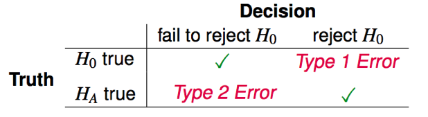

```{r setup, include=FALSE}
knitr::opts_chunk$set(echo = TRUE)
```

## Loading Libraries
Use the following syntax to load any libraries that you need. This code will prevent errors that will interfere with knitting of the Rmd file.
Also note that the `include=FALSE` option will prevent this code chunk from appearing in the markdown file.

We will load the entire tidyverse library, which includes *dplyr*, *ggplot2*, *readr*, and other packages.

```{r Load Libraries, include=FALSE}
if (!require("MASS")) install.packages("MASS"); library(MASS)
if (!require("cowplot")) install.packages("cowplot"); library(cowplot)
if (!require("tidyverse")) install.packages("tidyverse"); library(tidyverse)
```

## Objectives for Lab 5

1. Statistical tests using pairwise comparisons
2. Generalized linear models

The following exercise is adapted from the outstanding book Handbook of Biological Statistics (3rd ed.), by McDonald, J.H. 2014. 
http://www.biostathandbook.com/multiplecomparisons.html

The R code is adapted from http://rcompanion.org/rcompanion/f_01.html

## Background

García-Arenzana et al. (2014) tested associations of 25 dietary variables with mammographic density, an important risk factor for breast cancer, in 3548 Spanish women. 

García-Arenzana, N., E.M. Navarrete-Muñoz, V. Lope, P. Moreo, S. Laso-Pablos, N. Ascunce, F. Casanova-Gómez, C. Sánchez-Contador, C. Santamariña, N. Aragonés, B.P. Gómez, J. Vioque, and M. Pollán. 2014. Calorie intake, olive oil consumption and mammographic density among Spanish women. International journal of cancer 134: 1916-1925. https://onlinelibrary.wiley.com/doi/full/10.1002/ijc.28513

```{r Data Entry}
Data <- read.table(textConnection("
Food               p
Blue_fish         .34
Bread             .594
Butter            .212
Carbohydrates     .384
Cereals_and_pasta .074
Dairy_products    .94
Eggs              .275
Fats              .696
Fruit             .269
Legumes           .341
Nuts              .06
Olive_oil         .008
Potatoes          .569
Processed_meat    .986
Proteins           .042
Red_meat           .251
Semi-skimmed_milk  .942
Skimmed_milk       .222
Sweets             .762
Total_calories     .001
Total_meat         .975
Vegetables         .216
White_fish         .205
White_meat         .041
Whole_milk         .039
"),header=TRUE)
Data
```

## Unadjusted p Values

Use dplyr to arrange the data frame in order of p values.
Use dplyr to filter the data frame for p values < 0.05.

```{r}

```

## Bonferroni Correction

As you can see, five of the variables show a significant (p<0.05) P value. 
However, because García-Arenzana et al. (2014) tested 25 dietary variables, you'd expect one or two variables to show a significant result purely by chance, even if diet had no real effect on mammographic density. 
Applying the Bonferroni correction, you'd divide p=0.05 by the number of tests (25) to get the Bonferroni critical value, so a test would have to have p<0.002 to be significant. 
Under that criterion, only the test for total calories is significant.

To apply the Bonferroni correction to this table, you can use the function p.adjust() and method = "bonferroni".
Use dplyr to mutate the data frame, adding a column for Bonferroni-adjusted p values.
Now which dietary variables are significant?

```{r}

```


## Limitations of the Bonferroni Correction

The Bonferroni correction is appropriate when a single false positive in a set of tests would be a problem. 
It is mainly useful when there are a fairly small number of multiple comparisons and you're looking for one or two that might be significant. 
However, if you have a large number of multiple comparisons and you're looking for many that might be significant, the Bonferroni correction may lead to a very high rate of false negatives. 
For example, let's say you're comparing the expression level of 20,000 genes between liver cancer tissue and normal liver tissue. 
Based on previous studies, you are hoping to find dozens or hundreds of genes with different expression levels. 
If you use the Bonferroni correction, a p value would have to be less than 0.05/20000=0.0000025 to be significant. 
Only genes with huge differences in expression will have a p value that low, and could miss out on a lot of important differences just because you wanted to be sure that your results did not include a single false positive.



Type 1 Error = False Positive

Type 2 Error = False Negative

Another important issue with the Bonferroni correction is deciding what constitutes a "family" of statistical tests. 
García-Arenzana et al. (2014) tested 25 dietary variables, so are these tests one "family," making the critical p value 0.05/25? 
But they also measured 13 non-dietary variables such as age, education, and socioeconomic status; should they be included in the family of tests, making the critical p value 0.05/38? 
And what if in 2015, García-Arenzana et al. write another paper in which they compare an additional 30 dietary variables between breast cancer and non-breast cancer patients; should they include those in their family of tests, and go back and reanalyze the data in their 2014 paper using a critical p value of 0.05/55? 
There is no firm rule on this; you'll have to use your judgment, based on just how bad a false positive would be. 
Obviously, you should make this decision before you look at the results, otherwise it would be too easy to subconsciously rationalize a family size that gives you the results you want.

Use p.adjust to test the effect of 55 comparisons by setting n=55. (Note you should never do this for real experiments!)

```{r}

```

***
STOP HERE
***

## False discovery rate: Benjamini–Hochberg procedure

An alternative approach is to control the false discovery rate (FDR). 
This is the proportion of "discoveries" (significant results) that are actually false positives. 
For example, let's say you're using microarrays to compare expression levels for 20,000 genes between liver tumors and normal liver cells. 
You're going to do additional experiments on any genes that show a significant difference between the normal and tumor cells, and you're willing to accept up to 10% of the genes with significant results being false positives; you'll find out they're false positives when you do the followup experiments. 
In this case, you would set your false discovery rate to 10%. 
You are willing to take a 10% chance that any individual gene is a false discovery (Type 1 statistical error).

One good technique for controlling the false discovery rate was briefly mentioned by Simes (1986) and developed in detail by Benjamini and Hochberg (1995). 
Put the individual p values in order, from smallest to largest. 
The smallest p value has a rank of i=1, then next smallest has i=2, etc. 
Compare each individual p value to its Benjamini-Hochberg critical value, (i/m)Q, where i is the rank, m is the total number of tests, and Q is the false discovery rate you choose. 
The largest p value that has p<(i/m)Q is significant, and all of the p values smaller than it are also significant, even the ones that aren't less than their Benjamini-Hochberg critical value.

Simes, R.J. 1986. An improved Bonferroni procedure for multiple tests of significance. Biometrika 73: 751-754.

Benjamini, Y., and Y. Hochberg. 1995. Controlling the false discovery rate: a practical and powerful approach to multiple testing. Journal of the Royal Statistical Society B 57: 289-300.

Use dplyr to mutate the data frame, adding a column for Benjamini-Hochberg-adjusted p values. 
This can be called using either the method "BH" or "fdr" in the p.adjust function.
Now which dietary variables are significant at an FDR cutoff of 0.05? At an FDR cutoff of 0.25? 
How do the adjusted p-values for the BH procedure compare to the Bonferroni procedure?

```{r}

```

You should carefully choose your false discovery rate BEFORE analyzing your data. 
Usually, when you're doing a large number of statistical tests, your experiment is just the first, exploratory step, and you're going to follow up with more experiments on the interesting individual results. 
If the cost of additional experiments is low and the cost of a false negative (missing a potentially important discovery) is high, you should probably use a fairly high false discovery rate, like 0.10 or 0.25, so that you don't miss anything important. 
Frequently people use a false discovery rate of 0.05, probably because of confusion about the difference between false discovery rate and probability of a false positive when the null is true; a false discovery rate of 0.05 is probably too low for many experiments.

The Benjamini-Hochberg procedure is less sensitive than the Bonferroni procedure to your decision about what is a "family" of tests. 
If you increase the number of tests, and the distribution of p values is the same in the newly added tests as in the original tests, the Benjamini-Hochberg procedure will yield the same proportion of significant results. 
For example, if García-Arenzana et al. (2014) had looked at 50 variables instead of 25 and the new 25 tests had the same set of p values as the original 25, they would have 10 significant results under Benjamini-Hochberg with a false discovery rate of 0.25. 
This doesn't mean you can completely ignore the question of what constitutes a family; if you mix two sets of tests, one with some low p values and a second set without low p values, you will reduce the number of significant results compared to just analyzing the first set by itself.

***
STOP HERE
***

## Limitations of Benjamini-Hochberg

The Bonferroni correction and Benjamini-Hochberg procedure assume that the individual tests are independent of each other, as when you are comparing sample A vs. sample B, C vs. D, E vs. F, etc. 
If you are comparing sample A vs. sample B, A vs. C, A vs. D, etc., the comparisons are not independent; if A is higher than B, there's a good chance that A will be higher than C as well. 
An example of an experimental design with multiple, non-independent comparisons is when you compare multiple variables between groups, and the variables are correlated with each other within groups. 
An example would be knocking out your favorite gene in mice and comparing everything you can think of on knockout vs. control mice: length, weight, strength, running speed, food consumption, feces production, etc. 
All of these variables are likely to be correlated within groups; mice that are longer will probably also weigh more, would be stronger, run faster, eat more food, and poop more. 
To analyze this kind of experiment, you can use a generalized linear model (see below).

## When not to correct for multiple comparisons

The goal of multiple comparisons corrections is to reduce the number of false positives, because false positives can be embarrassing, confusing, and cause you and other people to waste your time. 
An unfortunate byproduct of correcting for multiple comparisons is that you may increase the number of false negatives (Type 2 statistical errors), where there really is an effect but you don't detect it as statistically significant. 
If false negatives are very costly, you may not want to correct for multiple comparisons at all. 
For example, let's say you've gone to a lot of trouble and expense to knock out your favorite gene, mannose-6-phosphate isomerase (Mpi), in a strain of mice that spontaneously develop lots of tumors. 
Hands trembling with excitement, you get the first Mpi-/- mice and start measuring things: blood pressure, growth rate, maze-learning speed, bone density, coat glossiness, everything you can think of to measure on a mouse. 
You measure 50 things on Mpi-/- mice and normal mice, run the appropriate statistical tests, and the smallest p value is 0.013 for a difference in tumor size. 
If you use a Bonferroni correction, that p=0.013 won't be close to significant (adjusted p = 0.65); it might not meet your FDR cutoff with the Benjamini-Hochberg procedure, either, if you set it too low. 
Should you conclude that there's no significant difference between the Mpi-/- and Mpi+/+ mice, write a boring little paper titled "Lack of anything interesting in Mpi-/- mice," and look for another project? 
No, your paper should be "Possible effect of Mpi on cancer." 
You should be suitably cautious, of course, and emphasize in the paper that there's a good chance that your result is a false positive; but the cost of a false positive—if further experiments show that Mpi really has no effect on tumors—is just a few more experiments. 
The cost of a false negative, on the other hand, could be that you've missed out on an important discovery.

***
STOP HERE
***

# Generalized Linear Models

We are next going to revisit the msleep dataset that we introduced in Lab 01. 

The msleep dataset is part of the ggplot2 package. It has 11 variables:
- name	= species common name
- genus	= genus name
- vore	= feeding type (carnivore/herbivore/omnivore/insectivore)
- order	= name of the order
- conservation	= the IUCN conservation status of the species (lc/nt/en/domesticated vu/cd)
- sleep_total	= total sleep time (hours)
- sleep_rem	= REM sleep time (hours)
- sleep_cycle	= length of sleep cycle (hours)
- awake	= time spent awake (hours)
- brainwt	= brain weight (kg)
- bodywt	= body weight (kg)

```{r}
data(msleep)
str(msleep)
```

Below is one of the graphs from Lab 1, where we found that total sleep is correlated with log body weight.

```{r}
ggplot(msleep) +
  aes(x = log10(bodywt), y = sleep_total) +
  geom_point(aes(color = factor(vore))) +
  geom_smooth(method=lm , color="black", se=TRUE) +
  theme_cowplot() +
  labs(color="Feeding Style") +
  xlab("Log body weight (kg)") + 
  ylab("Total sleep (hr/day)")
```

The linear model provided strong evidence of the significance of this association.

```{r Statistics on linear regression}
sleepfit = lm(sleep_total ~ log(bodywt), data=msleep)
summary(sleepfit)
```

Using a generalized linear model without an explicit "method" linking function is the same as using a linear model.

```{r simple GLM}
sleepglm = glm(sleep_total ~ log10(bodywt), data=msleep)
summary(sleepglm)
```

In this next graph, we have used natural log transformations for both body weight and sleep cycle, to be consistent with the published analysis.
We have also looked at "order" insted of "vore"" status (the reason for this will be clear later).

```{r}
ggplot(msleep) +
  aes(x = log(bodywt), y = log(sleep_cycle)) +
  geom_point(aes(color = factor(order))) +
  geom_smooth(method=lm , color="black", se=TRUE) +
  theme_cowplot() +
  labs(color="Order") +
  xlab("Natural Log body weight (kg)") + 
  ylab("Natural Log sleep cycle (Sleep/Awake)")
```

Refer to the abstract of the original paper:
https://www.pnas.org/content/104/3/1051.abstract

The authors conclude that they "provide strong evidence that time scales for sleep are set by the brain's, not the whole-body, metabolic rate."

Plot and compare the summary for these two alternative models, using natural log transformations for both the brain/body weight and for sleep cycle.

```{r}

```


How do we determine which model is preferred?
Last week we discussed methods for model selection that focused on adjusted R squared or on p-values.
A better alternative is to use either the Akaike (pronounced "Aka"-"eek"-"A") information criterion or the Bayesian information criterion.
- https://en.wikipedia.org/wiki/Akaike_information_criterion
- https://en.wikipedia.org/wiki/Bayesian_information_criterion

These two methods can be used to compare two models (similar to how we used the anova() function last week). 
When two models are compared, the one with a lower AIC (or BIC) is said to be the favored model. 
Both methods quantify the trade-offs between the goodness of fit of the model and the simplicity of the model.

The two methods primarily differ in the penalty for adding additional factors to the model. 
BIC provides a stronger penalty and will help favor simpler models.

In this case, they would yield the same conclusion, as both models have the same number of parameters.
Which model has the lower AIC?


***
STOP HERE
***

## Complex Generalized Linear Models

Using the GLM we can put both body weight and brain weight in the same model to see how they compare.

```{r body-brain GLM}
sleepbodybrainglm <- glm(log(sleep_cycle) ~ log(bodywt) + log(brainwt), data=msleep)
summary(sleepbodybrainglm)
dropterm(sleepbodybrainglm)
```

Does this result support the conclusions of the paper?

We can also add categorical variables to see if they increase the power of the model to predict sleep cycle.

```{r full GLM}
sleepfullglm <- glm(log(sleep_cycle) ~ log(bodywt) + log(brainwt) + vore + order + conservation, data=msleep)
summary(sleepfullglm)
```

This full model has a lower AIC, but all of the parameters fail to reach our significance threshold!

We need to do drop some of the model parameters to improve the fit. 
Looking at the p values, you could simply guess which to eliminate. 
Alternatively, you could eliminate each one at a time to systematically test them. 


```{r}
dropterm(sleepfullglm)
```

The full model has an AIC of 4.2732 (as seen above and in the <none> row of the dropterm output).
Dropping several of the terms decreases the AIC, which is what we want.
You can see that the lowest AIC is found with dropping "conservation". 
(This makes sense as there is really not a reasonable expectation that conservation status should influence sleep cycles.)
Construct a new model without the conservation term and test it again for dropping a term.

```{r}

```

Continue dropping terms until the dropping any of the terms no longer decreases the AIC.


```{r}

```

```{r}

```

What was the final model? 


Does this support the conclusion in the abstract?


***
STOP HERE
***

## Interactions within models

It is important to consider whether the different terms within a model *interact* with each other. 
For example, the order Chiroptera in our dataset might be special, compared to the other mammals. 
Perhaps the sleep cycle of bats depends on their brain size in a different way than other mammals because they fly? 
To test for such interactions in a model, you simply indicate interactions between terms by using "*" instead of "+" between the terms:

instead of:

`log(sleep_cycle) ~ log(brainwt) + order`

we use: 

`log(sleep_cycle) ~ log(brainwt) * order`

or you can spell out each individual term and the interaction separately using ":" 

`log(sleep_cycle) ~ log(brainwt) + order + log(brainwt):order`

Test a new version of your best model with an interaction between the terms and use dropterm to determine if it improves the model.

```{r}

```

Note that dropterm does not try to individually drop the interacting terms - because the model would not make sense to keep the interaction but drop the main term. 
The model instead drops the interaction and tests that against the model without dropping the interaction.

Did adding an interaction improve this model?


***
STOP HERE
***

## Other Considerations

The example provided here used a linear linking function between each term and the variable of interest.
This is appropriate if the outcome variable has a normal distribution (in this case after transformation). 

GLMs can use other linking functions:
https://en.wikipedia.org/wiki/Generalized_linear_model#Link_function
The selection of this function will depend on the whether the response variables have error distribution models other than a normal distribution.
Other link functions are also necessary if the *outcome variable* is categorical or logical.

The built-in glm() function cannot handle negative binomial distributions, unfortunately. 
https://en.wikipedia.org/wiki/Negative_binomial_distribution 
These are quite common in biological data that derive from counting occurrences of something of interest. 
To use negative binomial distributions in a GLM, use the glm.nb() function in the MASS package (which also contains the dropterm() and addterm() functions).

It is important to note that when comparing different species (or genera) that there is an additional factor to consider - the *evolutionary relationship* of the species.
It is beyond the scope of this lab, but phylogenetically controlled regression models can incorporate this factor into their analysis.
Phylogenetic Generalized Least Squares models can control for the correlation within groups of closely-related species.
http://www.r-phylo.org/wiki/HowTo/PGLS