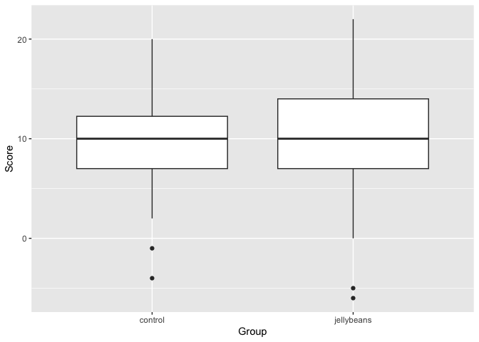
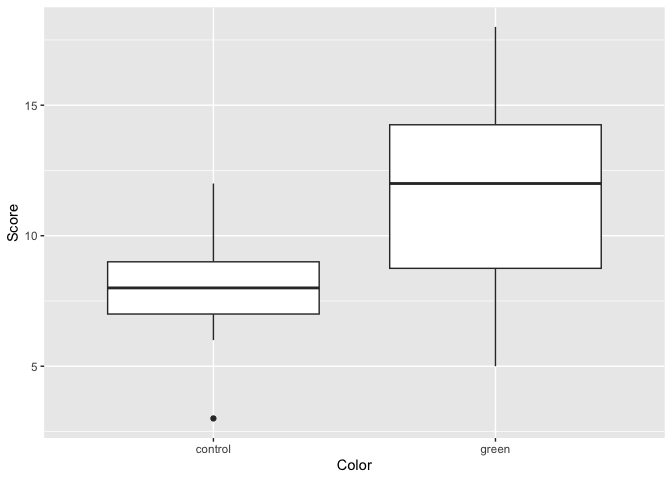
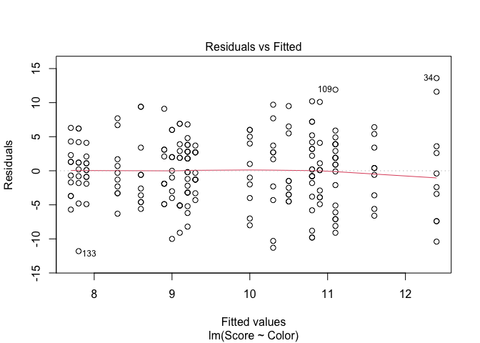
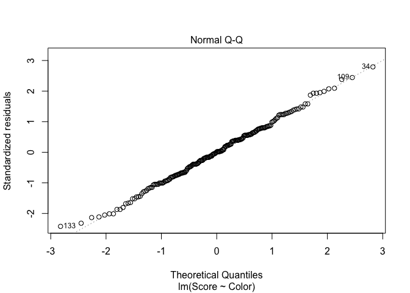
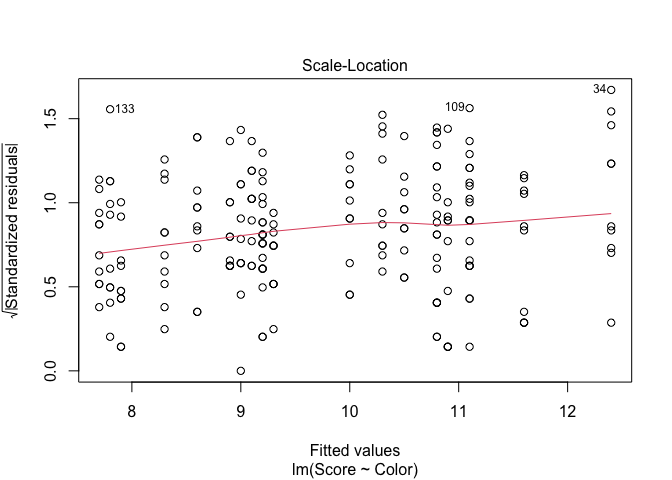
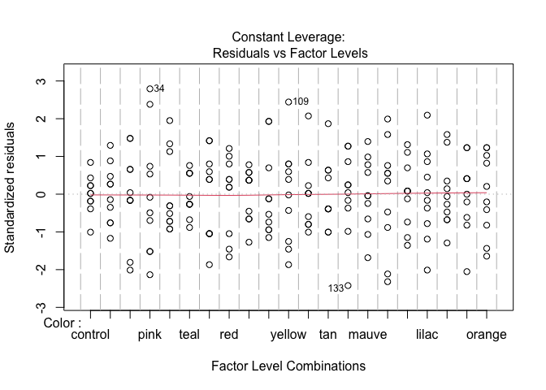

Lab 05 Warmup
================
Prof. Ken Field, Bucknell University
2/10/2019

## Loading Data

Scientists have been asked to investigate whether jelly beans cause
acne. They enrolled 200 high school students in a study where the
control group (n=100) avoided all jellybeans for 2 months. The treatment
group (n=100) were given a free bag of jellybeans every week and were
told to consume all of them before the next week. At the end of the
study, the acne level of each participant was scored.

``` r
acne <- read_csv("../04-Data/acne.csv")
```

    ## New names:
    ## Rows: 200 Columns: 3
    ## ── Column specification
    ## ──────────────────────────────────────────────────────── Delimiter: "," chr
    ## (1): Group dbl (2): ...1, Score
    ## ℹ Use `spec()` to retrieve the full column specification for this data. ℹ
    ## Specify the column types or set `show_col_types = FALSE` to quiet this message.
    ## • `` -> `...1`

``` r
str(acne)
```

    ## spc_tbl_ [200 × 3] (S3: spec_tbl_df/tbl_df/tbl/data.frame)
    ##  $ ...1 : num [1:200] 1 2 3 4 5 6 7 8 9 10 ...
    ##  $ Score: num [1:200] 9 3 10 4 7 5 7 10 16 11 ...
    ##  $ Group: chr [1:200] "control" "control" "control" "control" ...
    ##  - attr(*, "spec")=
    ##   .. cols(
    ##   ..   ...1 = col_double(),
    ##   ..   Score = col_double(),
    ##   ..   Group = col_character()
    ##   .. )
    ##  - attr(*, "problems")=<externalptr>

``` r
acne <- acne %>% 
  mutate(Group = as.factor(Group)) %>%
  select(Score, Group)
str(acne)
```

    ## tibble [200 × 2] (S3: tbl_df/tbl/data.frame)
    ##  $ Score: num [1:200] 9 3 10 4 7 5 7 10 16 11 ...
    ##  $ Group: Factor w/ 2 levels "control","jellybeans": 1 1 1 1 1 1 1 1 1 1 ...

## Statistical Test

The scientists determined that there was no link between jelly beans and
acne.

``` r
t.test(Score ~ Group, data = acne)
```

    ## 
    ##  Welch Two Sample t-test
    ## 
    ## data:  Score by Group
    ## t = -0.5573, df = 190.9, p-value = 0.578
    ## alternative hypothesis: true difference in means between group control and group jellybeans is not equal to 0
    ## 95 percent confidence interval:
    ##  -1.7703396  0.9903396
    ## sample estimates:
    ##    mean in group control mean in group jellybeans 
    ##                     9.93                    10.32

``` r
ggplot(acne, aes(x=Group, y=Score)) + 
  geom_boxplot()
```

<!-- -->

But people are skeptical and think that it might not be all jellybeans,
but only those of a certain color. So the scientists stop playing
Minecraft long enough to conduct a second study. This time they have a
control group (n=10) and twenty groups (n=10 per group) that each eat
bags of only a single color of jellybean.

``` r
acne2 <- read_csv("../04-Data/acne2.csv")
```

    ## New names:
    ## Rows: 210 Columns: 3
    ## ── Column specification
    ## ──────────────────────────────────────────────────────── Delimiter: "," chr
    ## (1): Color dbl (2): ...1, Score
    ## ℹ Use `spec()` to retrieve the full column specification for this data. ℹ
    ## Specify the column types or set `show_col_types = FALSE` to quiet this message.
    ## • `` -> `...1`

``` r
acne2 <- acne2 %>% 
  select(Score, Color) %>%
  mutate(Color = as.factor(Color))
str(acne2)
```

    ## tibble [210 × 2] (S3: tbl_df/tbl/data.frame)
    ##  $ Score: num [1:210] 3 6 9 12 7 9 8 7 10 8 ...
    ##  $ Color: Factor w/ 21 levels "beige","black",..: 5 5 5 5 5 5 5 5 5 5 ...

``` r
# a for loop probably would have been better!
t.test(Score ~ Color, data = filter(acne2, Color == "control" | Color == "purple"))
```

    ## 
    ##  Welch Two Sample t-test
    ## 
    ## data:  Score by Color
    ## t = 0.14026, df = 15.281, p-value = 0.8903
    ## alternative hypothesis: true difference in means between group control and group purple is not equal to 0
    ## 95 percent confidence interval:
    ##  -2.834487  3.234487
    ## sample estimates:
    ## mean in group control  mean in group purple 
    ##                   7.9                   7.7

``` r
t.test(Score ~ Color, data = filter(acne2, Color == "control" | Color == "brown"))
```

    ## 
    ##  Welch Two Sample t-test
    ## 
    ## data:  Score by Color
    ## t = 1.4653, df = 12.082, p-value = 0.1684
    ## alternative hypothesis: true difference in means between group brown and group control is not equal to 0
    ## 95 percent confidence interval:
    ##  -1.408745  7.208745
    ## sample estimates:
    ##   mean in group brown mean in group control 
    ##                  10.8                   7.9

``` r
t.test(Score ~ Color, data = filter(acne2, Color == "control" | Color == "pink"))
```

    ## 
    ##  Welch Two Sample t-test
    ## 
    ## data:  Score by Color
    ## t = -1.7045, df = 10.644, p-value = 0.1173
    ## alternative hypothesis: true difference in means between group control and group pink is not equal to 0
    ## 95 percent confidence interval:
    ##  -10.334582   1.334582
    ## sample estimates:
    ## mean in group control    mean in group pink 
    ##                   7.9                  12.4

``` r
t.test(Score ~ Color, data = filter(acne2, Color == "control" | Color == "blue"))
```

    ## 
    ##  Welch Two Sample t-test
    ## 
    ## data:  Score by Color
    ## t = 1.4449, df = 12.805, p-value = 0.1725
    ## alternative hypothesis: true difference in means between group blue and group control is not equal to 0
    ## 95 percent confidence interval:
    ##  -1.293348  6.493348
    ## sample estimates:
    ##    mean in group blue mean in group control 
    ##                  10.5                   7.9

``` r
t.test(Score ~ Color, data = filter(acne2, Color == "control" | Color == "teal"))
```

    ## 
    ##  Welch Two Sample t-test
    ## 
    ## data:  Score by Color
    ## t = -1.1976, df = 17.655, p-value = 0.2469
    ## alternative hypothesis: true difference in means between group control and group teal is not equal to 0
    ## 95 percent confidence interval:
    ##  -3.85952  1.05952
    ## sample estimates:
    ## mean in group control    mean in group teal 
    ##                   7.9                   9.3

``` r
t.test(Score ~ Color, data = filter(acne2, Color == "control" | Color == "salmon"))
```

    ## 
    ##  Welch Two Sample t-test
    ## 
    ## data:  Score by Color
    ## t = -0.61758, df = 12.21, p-value = 0.5482
    ## alternative hypothesis: true difference in means between group control and group salmon is not equal to 0
    ## 95 percent confidence interval:
    ##  -5.425551  3.025551
    ## sample estimates:
    ## mean in group control  mean in group salmon 
    ##                   7.9                   9.1

``` r
t.test(Score ~ Color, data = filter(acne2, Color == "control" | Color == "red"))
```

    ## 
    ##  Welch Two Sample t-test
    ## 
    ## data:  Score by Color
    ## t = -1.8214, df = 13.012, p-value = 0.09161
    ## alternative hypothesis: true difference in means between group control and group red is not equal to 0
    ## 95 percent confidence interval:
    ##  -6.9951793  0.5951793
    ## sample estimates:
    ## mean in group control     mean in group red 
    ##                   7.9                  11.1

``` r
t.test(Score ~ Color, data = filter(acne2, Color == "control" | Color == "turquoise"))
```

    ## 
    ##  Welch Two Sample t-test
    ## 
    ## data:  Score by Color
    ## t = -0.98584, df = 16.29, p-value = 0.3386
    ## alternative hypothesis: true difference in means between group control and group turquoise is not equal to 0
    ## 95 percent confidence interval:
    ##  -4.091411  1.491411
    ## sample estimates:
    ##   mean in group control mean in group turquoise 
    ##                     7.9                     9.2

``` r
t.test(Score ~ Color, data = filter(acne2, Color == "control" | Color == "magenta"))
```

    ## 
    ##  Welch Two Sample t-test
    ## 
    ## data:  Score by Color
    ## t = -0.36266, df = 12.258, p-value = 0.723
    ## alternative hypothesis: true difference in means between group control and group magenta is not equal to 0
    ## 95 percent confidence interval:
    ##  -4.895701  3.495701
    ## sample estimates:
    ## mean in group control mean in group magenta 
    ##                   7.9                   8.6

``` r
t.test(Score ~ Color, data = filter(acne2, Color == "control" | Color == "yellow"))
```

    ## 
    ##  Welch Two Sample t-test
    ## 
    ## data:  Score by Color
    ## t = -1.496, df = 11.597, p-value = 0.1614
    ## alternative hypothesis: true difference in means between group control and group yellow is not equal to 0
    ## 95 percent confidence interval:
    ##  -7.87864  1.47864
    ## sample estimates:
    ## mean in group control  mean in group yellow 
    ##                   7.9                  11.1

``` r
t.test(Score ~ Color, data = filter(acne2, Color == "control" | Color == "grey"))
```

    ## 
    ##  Welch Two Sample t-test
    ## 
    ## data:  Score by Color
    ## t = -1.8534, df = 13.804, p-value = 0.08532
    ## alternative hypothesis: true difference in means between group control and group grey is not equal to 0
    ## 95 percent confidence interval:
    ##  -6.4762652  0.4762652
    ## sample estimates:
    ## mean in group control    mean in group grey 
    ##                   7.9                  10.9

``` r
t.test(Score ~ Color, data = filter(acne2, Color == "control" | Color == "tan"))
```

    ## 
    ##  Welch Two Sample t-test
    ## 
    ## data:  Score by Color
    ## t = -0.637, df = 14.134, p-value = 0.5343
    ## alternative hypothesis: true difference in means between group control and group tan is not equal to 0
    ## 95 percent confidence interval:
    ##  -4.364011  2.364011
    ## sample estimates:
    ## mean in group control     mean in group tan 
    ##                   7.9                   8.9

``` r
t.test(Score ~ Color, data = filter(acne2, Color == "control" | Color == "cyan"))
```

    ## 
    ##  Welch Two Sample t-test
    ## 
    ## data:  Score by Color
    ## t = 0.053325, df = 12.472, p-value = 0.9583
    ## alternative hypothesis: true difference in means between group control and group cyan is not equal to 0
    ## 95 percent confidence interval:
    ##  -3.96878  4.16878
    ## sample estimates:
    ## mean in group control    mean in group cyan 
    ##                   7.9                   7.8

``` r
t.test(Score ~ Color, data = filter(acne2, Color == "control" | Color == "green"))
```

    ## 
    ##  Welch Two Sample t-test
    ## 
    ## data:  Score by Color
    ## t = -2.349, df = 14.097, p-value = 0.03392
    ## alternative hypothesis: true difference in means between group control and group green is not equal to 0
    ## 95 percent confidence interval:
    ##  -7.0761946 -0.3238054
    ## sample estimates:
    ## mean in group control   mean in group green 
    ##                   7.9                  11.6

``` r
t.test(Score ~ Color, data = filter(acne2, Color == "control" | Color == "mauve"))
```

    ## 
    ##  Welch Two Sample t-test
    ## 
    ## data:  Score by Color
    ## t = -0.77922, df = 13.497, p-value = 0.4493
    ## alternative hypothesis: true difference in means between group control and group mauve is not equal to 0
    ## 95 percent confidence interval:
    ##  -4.89078  2.29078
    ## sample estimates:
    ## mean in group control   mean in group mauve 
    ##                   7.9                   9.2

``` r
t.test(Score ~ Color, data = filter(acne2, Color == "control" | Color == "beige"))
```

    ## 
    ##  Welch Two Sample t-test
    ## 
    ## data:  Score by Color
    ## t = 1.0234, df = 11.123, p-value = 0.3279
    ## alternative hypothesis: true difference in means between group beige and group control is not equal to 0
    ## 95 percent confidence interval:
    ##  -2.754789  7.554789
    ## sample estimates:
    ##   mean in group beige mean in group control 
    ##                  10.3                   7.9

``` r
t.test(Score ~ Color, data = filter(acne2, Color == "control" | Color == "lilac"))
```

    ## 
    ##  Welch Two Sample t-test
    ## 
    ## data:  Score by Color
    ## t = -1.4612, df = 12.063, p-value = 0.1695
    ## alternative hypothesis: true difference in means between group control and group lilac is not equal to 0
    ## 95 percent confidence interval:
    ##  -7.221709  1.421709
    ## sample estimates:
    ## mean in group control   mean in group lilac 
    ##                   7.9                  10.8

``` r
t.test(Score ~ Color, data = filter(acne2, Color == "control" | Color == "black"))
```

    ## 
    ##  Welch Two Sample t-test
    ## 
    ## data:  Score by Color
    ## t = 0.25076, df = 13.96, p-value = 0.8057
    ## alternative hypothesis: true difference in means between group black and group control is not equal to 0
    ## 95 percent confidence interval:
    ##  -3.022146  3.822146
    ## sample estimates:
    ##   mean in group black mean in group control 
    ##                   8.3                   7.9

``` r
t.test(Score ~ Color, data = filter(acne2, Color == "control" | Color == "peach"))
```

    ## 
    ##  Welch Two Sample t-test
    ## 
    ## data:  Score by Color
    ## t = -0.6436, df = 13.264, p-value = 0.5308
    ## alternative hypothesis: true difference in means between group control and group peach is not equal to 0
    ## 95 percent confidence interval:
    ##  -4.784893  2.584893
    ## sample estimates:
    ## mean in group control   mean in group peach 
    ##                   7.9                   9.0

``` r
t.test(Score ~ Color, data = filter(acne2, Color == "control" | Color == "orange"))
```

    ## 
    ##  Welch Two Sample t-test
    ## 
    ## data:  Score by Color
    ## t = -1.1485, df = 12.672, p-value = 0.272
    ## alternative hypothesis: true difference in means between group control and group orange is not equal to 0
    ## 95 percent confidence interval:
    ##  -6.060593  1.860593
    ## sample estimates:
    ## mean in group control  mean in group orange 
    ##                   7.9                  10.0

## Whoa

``` r
ggplot(filter(acne2, Color == "control" | Color == "green"), aes(x=Color, y=Score)) + 
  geom_boxplot()
```

<!-- -->

<https://xkcd.com/882/>

## Linear Model Approach

Note that a linear model would produce different results. First, to set
one of the levels as the reference (the control group), we need to make
sure it is the first level of the factor.

``` r
jellybeans = c("control","purple","brown","pink","blue","teal",
               "salmon","red","turquoise","magenta","yellow",
               "grey","tan","cyan","mauve","beige",
               "green","lilac","black","peach","orange")
               
acne2 <- read_csv("../04-Data/acne2.csv")
```

    ## New names:
    ## Rows: 210 Columns: 3
    ## ── Column specification
    ## ──────────────────────────────────────────────────────── Delimiter: "," chr
    ## (1): Color dbl (2): ...1, Score
    ## ℹ Use `spec()` to retrieve the full column specification for this data. ℹ
    ## Specify the column types or set `show_col_types = FALSE` to quiet this message.
    ## • `` -> `...1`

``` r
acne3 <- acne2 %>%
  mutate(Color = factor(Color, levels = jellybeans))
colorlm <- lm(Score ~ Color, data = acne3)
summary(colorlm)
```

    ## 
    ## Call:
    ## lm(formula = Score ~ Color, data = acne3)
    ## 
    ## Residuals:
    ##     Min      1Q  Median      3Q     Max 
    ## -11.800  -3.475   0.050   3.175  13.600 
    ## 
    ## Coefficients:
    ##                Estimate Std. Error t value Pr(>|t|)    
    ## (Intercept)       7.900      1.624   4.865  2.4e-06 ***
    ## Colorpurple      -0.200      2.296  -0.087   0.9307    
    ## Colorbrown        2.900      2.296   1.263   0.2082    
    ## Colorpink         4.500      2.296   1.960   0.0515 .  
    ## Colorblue         2.600      2.296   1.132   0.2590    
    ## Colorteal         1.400      2.296   0.610   0.5428    
    ## Colorsalmon       1.200      2.296   0.523   0.6019    
    ## Colorred          3.200      2.296   1.393   0.1651    
    ## Colorturquoise    1.300      2.296   0.566   0.5720    
    ## Colormagenta      0.700      2.296   0.305   0.7608    
    ## Coloryellow       3.200      2.296   1.393   0.1651    
    ## Colorgrey         3.000      2.296   1.306   0.1930    
    ## Colortan          1.000      2.296   0.435   0.6637    
    ## Colorcyan        -0.100      2.296  -0.044   0.9653    
    ## Colormauve        1.300      2.296   0.566   0.5720    
    ## Colorbeige        2.400      2.296   1.045   0.2973    
    ## Colorgreen        3.700      2.296   1.611   0.1088    
    ## Colorlilac        2.900      2.296   1.263   0.2082    
    ## Colorblack        0.400      2.296   0.174   0.8619    
    ## Colorpeach        1.100      2.296   0.479   0.6325    
    ## Colororange       2.100      2.296   0.914   0.3616    
    ## ---
    ## Signif. codes:  0 '***' 0.001 '**' 0.01 '*' 0.05 '.' 0.1 ' ' 1
    ## 
    ## Residual standard error: 5.135 on 189 degrees of freedom
    ## Multiple R-squared:  0.06721,    Adjusted R-squared:  -0.03149 
    ## F-statistic: 0.6809 on 20 and 189 DF,  p-value: 0.8421

We find that because the linear model is testing the significance of
each level of the factor within the context of the whole dataset, that
it produces different p values. This is a better approach (if the
assumptions of the linear model are met).

``` r
plot(colorlm)
```

<!-- --><!-- --><!-- --><!-- -->

That doesn’t look bad, but we can definitely see the limitations of
having only 10 subjects per group.

## Multiple Testing Correction

We need to adjust the p-values for inflated false discoveries when
conducting multiple tests. The original, and most conservative method
for multiple test correction was described by Bonferoni.

``` r
color_pvalues <- coef(summary(colorlm))[,4]
p.adjust(color_pvalues, method = "bonferroni")
```

    ##    (Intercept)    Colorpurple     Colorbrown      Colorpink      Colorblue 
    ##   5.047936e-05   1.000000e+00   1.000000e+00   1.000000e+00   1.000000e+00 
    ##      Colorteal    Colorsalmon       Colorred Colorturquoise   Colormagenta 
    ##   1.000000e+00   1.000000e+00   1.000000e+00   1.000000e+00   1.000000e+00 
    ##    Coloryellow      Colorgrey       Colortan      Colorcyan     Colormauve 
    ##   1.000000e+00   1.000000e+00   1.000000e+00   1.000000e+00   1.000000e+00 
    ##     Colorbeige     Colorgreen     Colorlilac     Colorblack     Colorpeach 
    ##   1.000000e+00   1.000000e+00   1.000000e+00   1.000000e+00   1.000000e+00 
    ##    Colororange 
    ##   1.000000e+00

Acknowledgement:
<https://stackoverflow.com/questions/23838937/extract-pvalue-from-glm>

## Behind the numbers

Both acne datasets were generated randomly using a normal distribution.
Note that if you run this code chunk and then rerun the analysis above,
you will get different results!

``` r
acne <- data.frame(round(rnorm(200,10,5)))
names(acne) = c("Score")
acne$Group <- c(rep("control", each=100), rep("jellybeans", each=100))

jellybeans = c("control","purple","brown","pink","blue","teal",
               "salmon","red","turquoise","magenta","yellow",
               "grey","tan","cyan","mauve","beige",
               "green","lilac","black","peach","orange")

acne2 <- data.frame(round(rnorm(210,10,5)))
names(acne2) = c("Score")
acne2$Color <- c(rep(jellybeans, each=10))
```
