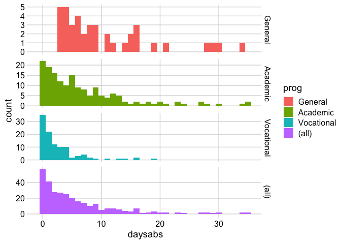
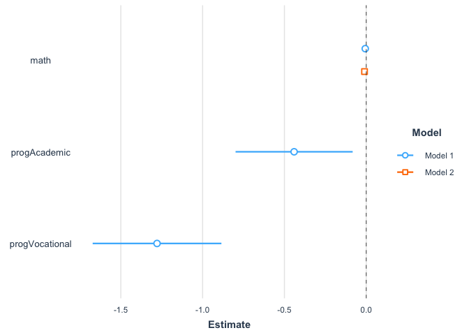
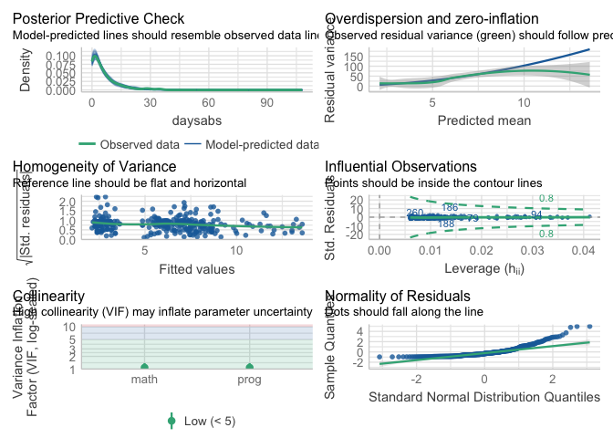
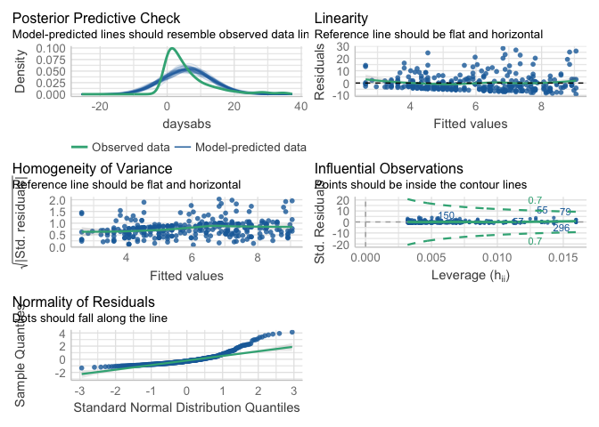
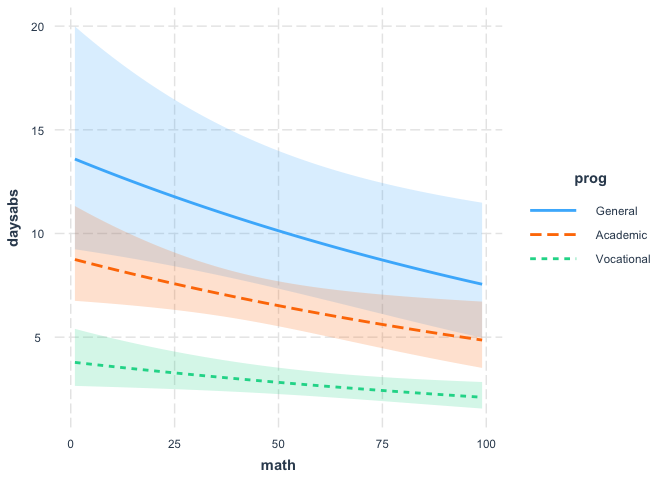
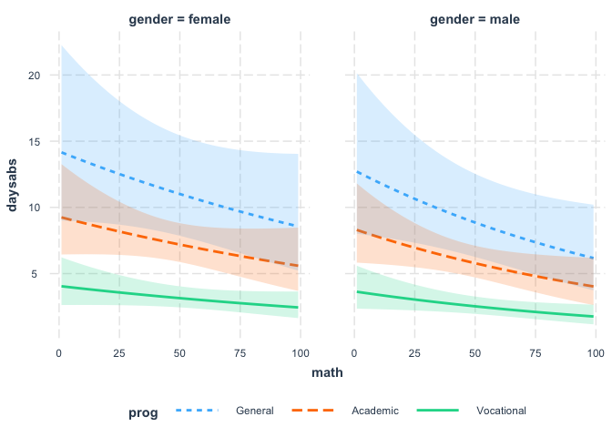
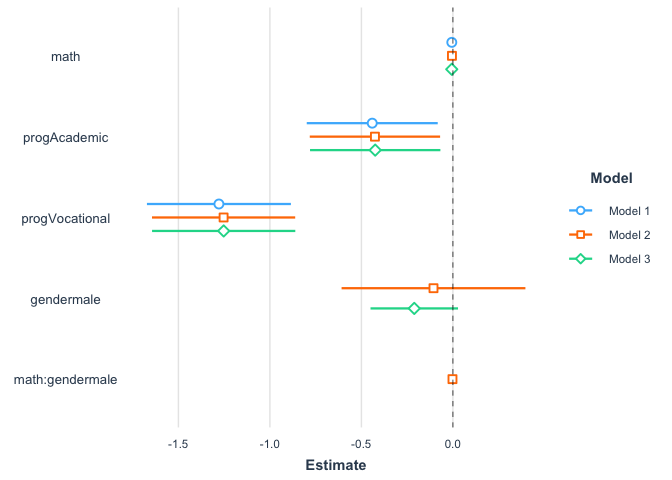
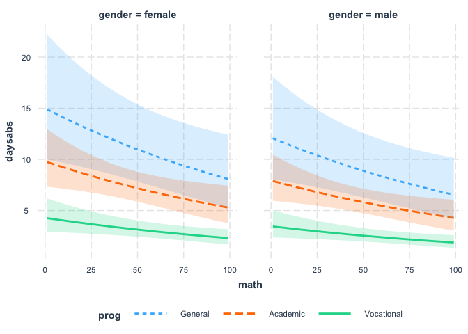
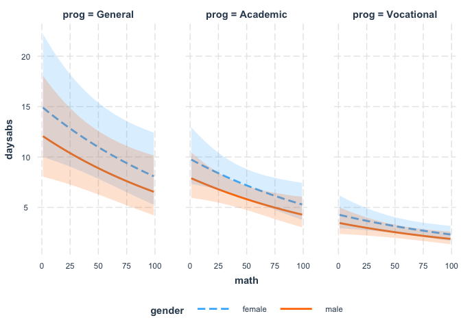
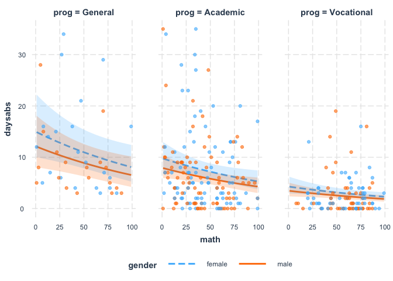

Lab 07
================
Outstanding Data Scientist
28 Feb 2023

Note that I loaded quite a few new packages. These packages, like
`performance` and `interactions` are useful for advanced model selection
and might be worth exploring on your own. The `jtools` package provides
plot_summs(), a better way to vizulize the coefficients of a model. The
`skimr` package is a great tool for peeking at your data during
exploration. The package `MASS` is essential for `glm.nb()`. The package
`foreign` is needed to read in the .dta file.

## Background

School administrators study the attendance behavior of high school
juniors at two schools. Predictors of the number of days of absence
include the type of program in which the student is enrolled and a
standardized test in math.

We have attendance data on 314 high school juniors from two urban high
schools in the file nb_data. The response variable of interest is days
absent, daysabs. The variable math gives the standardized math score for
each student. The variable prog is a three-level nominal variable
indicating the type of instructional program in which the student is
enrolled.

## Data Loading and Wrangling

Load in the data and then convert the appropriate columns to factors.

``` r
original.dat <- read.dta("https://stats.idre.ucla.edu/stat/stata/dae/nb_data.dta")
dat <- original.dat %>%
    mutate(prog = factor(prog, levels = 1:3, labels = c("General", "Academic", "Vocational")),
           id = as.character(id))
# Some different summary functions
summary(dat)
```

    ##       id               gender         math          daysabs      
    ##  Length:314         female:160   Min.   : 1.00   Min.   : 0.000  
    ##  Class :character   male  :154   1st Qu.:28.00   1st Qu.: 1.000  
    ##  Mode  :character                Median :48.00   Median : 4.000  
    ##                                  Mean   :48.27   Mean   : 5.955  
    ##                                  3rd Qu.:70.00   3rd Qu.: 8.000  
    ##                                  Max.   :99.00   Max.   :35.000  
    ##          prog    
    ##  General   : 40  
    ##  Academic  :167  
    ##  Vocational:107  
    ##                  
    ##                  
    ## 

``` r
glimpse(dat)
```

    ## Rows: 314
    ## Columns: 5
    ## $ id      <chr> "1001", "1002", "1003", "1004", "1005", "1006", "1007", "1008"…
    ## $ gender  <fct> male, male, female, female, female, female, female, male, male…
    ## $ math    <dbl> 63, 27, 20, 16, 2, 71, 63, 3, 51, 49, 31, 22, 73, 77, 10, 89, …
    ## $ daysabs <dbl> 4, 4, 2, 3, 3, 13, 11, 7, 10, 9, 4, 5, 5, 6, 1, 0, 1, 0, 5, 24…
    ## $ prog    <fct> Academic, Academic, Academic, Academic, Academic, Academic, Ac…

``` r
skim(dat)
```

|                                                  |      |
|:-------------------------------------------------|:-----|
| Name                                             | dat  |
| Number of rows                                   | 314  |
| Number of columns                                | 5    |
| \_\_\_\_\_\_\_\_\_\_\_\_\_\_\_\_\_\_\_\_\_\_\_   |      |
| Column type frequency:                           |      |
| character                                        | 1    |
| factor                                           | 2    |
| numeric                                          | 2    |
| \_\_\_\_\_\_\_\_\_\_\_\_\_\_\_\_\_\_\_\_\_\_\_\_ |      |
| Group variables                                  | None |

Data summary

**Variable type: character**

| skim_variable | n_missing | complete_rate | min | max | empty | n_unique | whitespace |
|:--------------|----------:|--------------:|----:|----:|------:|---------:|-----------:|
| id            |         0 |             1 |   4 |   4 |     0 |      314 |          0 |

**Variable type: factor**

| skim_variable | n_missing | complete_rate | ordered | n_unique | top_counts                  |
|:--------------|----------:|--------------:|:--------|---------:|:----------------------------|
| gender        |         0 |             1 | FALSE   |        2 | fem: 160, mal: 154          |
| prog          |         0 |             1 | FALSE   |        3 | Aca: 167, Voc: 107, Gen: 40 |

**Variable type: numeric**

| skim_variable | n_missing | complete_rate |  mean |    sd |  p0 | p25 | p50 | p75 | p100 | hist  |
|:--------------|----------:|--------------:|------:|------:|----:|----:|----:|----:|-----:|:------|
| math          |         0 |             1 | 48.27 | 25.36 |   1 |  28 |  48 |  70 |   99 | ▅▇▆▇▃ |
| daysabs       |         0 |             1 |  5.96 |  7.04 |   0 |   1 |   4 |   8 |   35 | ▇▂▁▁▁ |

## Data Exploration

Generate histograms to show daysab for all programs and then for each
academic program separately.

``` r
ggplot(dat, aes(daysabs, fill = prog)) + 
  geom_histogram(binwidth = 1) + 
  facet_grid(prog ~ ., margins = TRUE, scales = "free") +
  theme_minimal_grid()
```

<!-- -->

## Possible statistical models

Below is a list of some analysis methods you may have encountered. Some
of the methods listed are quite reasonable, while others have either
fallen out of favor or have limitations.

- Negative binomial regression -Negative binomial regression can be used
  for over-dispersed count data, that is when the conditional variance
  exceeds the conditional mean. It can be considered as a generalization
  of Poisson regression since it has the same mean structure as Poisson
  regression and it has an extra parameter to model the over-dispersion.
  If the conditional distribution of the outcome variable is
  over-dispersed, the confidence intervals for the Negative binomial
  regression are likely to be wider as compared to those from a Poisson
  regression model.
- Poisson regression – Poisson regression is often used for modeling
  count data. Poisson regression has a number of extensions useful for
  count models.
- Zero-inflated regression model – Zero-inflated models attempt to
  account for excess zeros. In other words, two kinds of zeros are
  thought to exist in the data, “true zeros” and “excess zeros”.
  Zero-inflated models estimate two equations simultaneously, one for
  the count model and one for the excess zeros.
- OLS regression – Count outcome variables are sometimes log-transformed
  and analyzed using OLS regression. Many issues arise with this
  approach, including loss of data due to undefined values generated by
  taking the log of zero (which is undefined), as well as the lack of
  capacity to model the dispersion.

## Negative Binomial GLM

Make a negative binomial glm and check its summary() and performance()

``` r
m1 <- glm.nb(daysabs ~ math + prog, data = dat)
summary(m1)
```

    ## 
    ## Call:
    ## glm.nb(formula = daysabs ~ math + prog, data = dat, init.theta = 1.032713156, 
    ##     link = log)
    ## 
    ## Deviance Residuals: 
    ##     Min       1Q   Median       3Q      Max  
    ## -2.1547  -1.0192  -0.3694   0.2285   2.5273  
    ## 
    ## Coefficients:
    ##                 Estimate Std. Error z value Pr(>|z|)    
    ## (Intercept)     2.615265   0.197460  13.245  < 2e-16 ***
    ## math           -0.005993   0.002505  -2.392   0.0167 *  
    ## progAcademic   -0.440760   0.182610  -2.414   0.0158 *  
    ## progVocational -1.278651   0.200720  -6.370 1.89e-10 ***
    ## ---
    ## Signif. codes:  0 '***' 0.001 '**' 0.01 '*' 0.05 '.' 0.1 ' ' 1
    ## 
    ## (Dispersion parameter for Negative Binomial(1.0327) family taken to be 1)
    ## 
    ##     Null deviance: 427.54  on 313  degrees of freedom
    ## Residual deviance: 358.52  on 310  degrees of freedom
    ## AIC: 1741.3
    ## 
    ## Number of Fisher Scoring iterations: 1
    ## 
    ## 
    ##               Theta:  1.033 
    ##           Std. Err.:  0.106 
    ## 
    ##  2 x log-likelihood:  -1731.258

``` r
performance(m1)
```

    ## # Indices of model performance
    ## 
    ## AIC      |     AICc |      BIC | Nagelkerke's R2 |  RMSE | Sigma | Score_log | Score_spherical
    ## ----------------------------------------------------------------------------------------------
    ## 1741.258 | 1741.453 | 1760.005 |           0.265 | 6.399 | 1.075 |    -2.921 |           0.046

Let’s compare that model to one without the academic program.

``` r
m2 <- glm.nb(daysabs ~ math, data = dat)
performance(m2)
```

    ## # Indices of model performance
    ## 
    ## AIC      |     AICc |      BIC | Nagelkerke's R2 |  RMSE | Sigma | Score_log | Score_spherical
    ## ----------------------------------------------------------------------------------------------
    ## 1782.306 | 1782.383 | 1793.554 |           0.076 | 6.812 | 1.071 |    -3.048 |           0.049

``` r
anova(m1, m2)
```

    ## Likelihood ratio tests of Negative Binomial Models
    ## 
    ## Response: daysabs
    ##         Model     theta Resid. df    2 x log-lik.   Test    df LR stat.
    ## 1        math 0.8558565       312       -1776.306                      
    ## 2 math + prog 1.0327132       310       -1731.258 1 vs 2     2 45.04798
    ##       Pr(Chi)
    ## 1            
    ## 2 1.65179e-10

Those results indicate that the model with program is significantly
better (p = 1.65e-10).

We can visualize the effect sizes and confidence intervals using the
plot_summs() function from jtools.

``` r
plot_summs(m1, m2)
```

    ## Error in glm.control(...) : 
    ##   unused argument (family = list("Negative Binomial(1.0327)", "log", function (mu) 
    ## log(mu), function (eta) 
    ## pmax(exp(eta), .Machine$double.eps), function (mu) 
    ## mu + mu^2/.Theta, function (y, mu, wt) 
    ## 2 * wt * (y * log(pmax(1, y)/mu) - (y + .Theta) * log((y + .Theta)/(mu + .Theta))), function (y, n, mu, wt, dev) 
    ## {
    ##     term <- (y + .Theta) * log(mu + .Theta) - y * log(mu) + lgamma(y + 1) - .Theta * log(.Theta) + lgamma(.Theta) - lgamma(.Theta + y)
    ##     2 * sum(term * wt)
    ## }, function (eta) 
    ## pmax(exp(eta), .Machine$double.eps), expression({
    ##     if (any(y < 0)) stop("negative values not allowed for the negative binomial family")
    ##     n <- rep(1, nobs)
    ##     mustart <- y + (y == 0)/6
    ## }), function (mu) 
    ## all(mu > 0), function (eta) 
    ## TRUE, function (object, nsim) 
    ## {
    ##     ftd <- fitted(object)
    ##     rnegbin(nsim * length(ftd), ftd, .Theta)
    ## }))

    ## Warning: Something went wrong when calculating the pseudo R-squared. Returning NA
    ## instead.

    ## Error in glm.control(...) : 
    ##   unused argument (family = list("Negative Binomial(0.8559)", "log", function (mu) 
    ## log(mu), function (eta) 
    ## pmax(exp(eta), .Machine$double.eps), function (mu) 
    ## mu + mu^2/.Theta, function (y, mu, wt) 
    ## 2 * wt * (y * log(pmax(1, y)/mu) - (y + .Theta) * log((y + .Theta)/(mu + .Theta))), function (y, n, mu, wt, dev) 
    ## {
    ##     term <- (y + .Theta) * log(mu + .Theta) - y * log(mu) + lgamma(y + 1) - .Theta * log(.Theta) + lgamma(.Theta) - lgamma(.Theta + y)
    ##     2 * sum(term * wt)
    ## }, function (eta) 
    ## pmax(exp(eta), .Machine$double.eps), expression({
    ##     if (any(y < 0)) stop("negative values not allowed for the negative binomial family")
    ##     n <- rep(1, nobs)
    ##     mustart <- y + (y == 0)/6
    ## }), function (mu) 
    ## all(mu > 0), function (eta) 
    ## TRUE, function (object, nsim) 
    ## {
    ##     ftd <- fitted(object)
    ##     rnegbin(nsim * length(ftd), ftd, .Theta)
    ## }))

    ## Warning: Something went wrong when calculating the pseudo R-squared. Returning NA
    ## instead.

<!-- -->

Another approach would be to use model selection to confirm the minimal
model. The stepAIC() function will take a model and iteratively perform
model selection in either the backward or forward direction.

``` r
stepAIC(m1, direction = "backward")
```

    ## Start:  AIC=1739.26
    ## daysabs ~ math + prog
    ## 
    ##        Df    AIC
    ## <none>    1739.3
    ## - math  1 1742.9
    ## - prog  2 1780.3

    ## 
    ## Call:  glm.nb(formula = daysabs ~ math + prog, data = dat, init.theta = 1.032713156, 
    ##     link = log)
    ## 
    ## Coefficients:
    ##    (Intercept)            math    progAcademic  progVocational  
    ##       2.615265       -0.005993       -0.440760       -1.278651  
    ## 
    ## Degrees of Freedom: 313 Total (i.e. Null);  310 Residual
    ## Null Deviance:       427.5 
    ## Residual Deviance: 358.5     AIC: 1741

It looks like we should keep both math and prog in the model.

## Check for interactions

``` r
m4 <- glm.nb(daysabs ~ math * prog, data = dat)
compare_performance(m1, m4)
```

    ## # Comparison of Model Performance Indices
    ## 
    ## Name |  Model |  AIC (weights) | AICc (weights) |  BIC (weights) | Nagelkerke's R2 |  RMSE | Sigma | Score_log | Score_spherical
    ## --------------------------------------------------------------------------------------------------------------------------------
    ## m1   | negbin | 1741.3 (0.778) | 1741.5 (0.793) | 1760.0 (0.993) |           0.265 | 6.399 | 1.075 |    -2.921 |           0.046
    ## m4   | negbin | 1743.8 (0.222) | 1744.1 (0.207) | 1770.0 (0.007) |           0.271 | 6.388 | 1.079 |    -2.918 |           0.047

``` r
stepAIC(m4, direction = "backward")
```

    ## Start:  AIC=1741.77
    ## daysabs ~ math * prog
    ## 
    ##             Df    AIC
    ## - math:prog  2 1739.3
    ## <none>         1741.8
    ## 
    ## Step:  AIC=1739.26
    ## daysabs ~ math + prog
    ## 
    ##        Df    AIC
    ## <none>    1739.3
    ## - math  1 1742.9
    ## - prog  2 1780.3

    ## 
    ## Call:  glm.nb(formula = daysabs ~ math + prog, data = dat, init.theta = 1.032713508, 
    ##     link = log)
    ## 
    ## Coefficients:
    ##    (Intercept)            math    progAcademic  progVocational  
    ##       2.615264       -0.005993       -0.440760       -1.278648  
    ## 
    ## Degrees of Freedom: 313 Total (i.e. Null);  310 Residual
    ## Null Deviance:       427.5 
    ## Residual Deviance: 358.5     AIC: 1741

Once again we arrive at the best model as `daysabs ~ math + prog`.

## Check model assumptions

First use the plot function to see if this model seems to be a
reasonable fit to the data. Let’s use a better function than just
plot(), try out the check_model() function of `performance`

``` r
check_model(m1)
```

    ## Variable `Component` is not in your data frame :/

<!-- -->

Clearly the QQ plot demonstrates that the data is NOT normally
distributed. But the other plots don’t look too bad. If you compare them
to a linear model, it looks better. And we can use the
compare_performance() function to compare the two models.

``` r
lm <- glm(daysabs ~ math, data = dat)
check_model(lm)
```

<!-- -->

``` r
compare_performance(m1, lm)
```

    ## # Comparison of Model Performance Indices
    ## 
    ## Name |  Model |  AIC (weights) | AICc (weights) |  BIC (weights) |  RMSE | Sigma | Nagelkerke's R2 | Score_log | Score_spherical |    R2
    ## ----------------------------------------------------------------------------------------------------------------------------------------
    ## m1   | negbin | 1741.3 (>.999) | 1741.5 (>.999) | 1760.0 (>.999) | 6.399 | 1.075 |           0.265 |    -2.921 |           0.046 |      
    ## lm   |    glm | 2103.5 (<.001) | 2103.5 (<.001) | 2114.7 (<.001) | 6.827 | 6.849 |                 |           |                 | 0.056

Negative binomial models assume the conditional means are not equal to
the conditional variances. This inequality is captured by estimating a
dispersion parameter (not shown in the output) that is held constant in
a Poisson model. Thus, the Poisson model is actually nested in the
negative binomial model. We can then use a likelihood ratio test to
compare these two and test this model assumption. To do this, compare
our nb model to a Poisson model (family = “poisson”).

To compare the two models, unfortunately we can’t use anova() which
requires both models to use the same glm function. Instead we can use
performance to see which model appears to have better information
statistics.

``` r
m3 <- glm(daysabs ~ math + prog, family = "poisson", data = dat)
compare_performance(m1, m3)
```

    ## # Comparison of Model Performance Indices
    ## 
    ## Name |  Model |  AIC (weights) | AICc (weights) |  BIC (weights) | Nagelkerke's R2 |  RMSE | Sigma | Score_log | Score_spherical
    ## --------------------------------------------------------------------------------------------------------------------------------
    ## m1   | negbin | 1741.3 (>.999) | 1741.5 (>.999) | 1760.0 (>.999) |           0.265 | 6.399 | 1.075 |    -2.921 |           0.046
    ## m3   |    glm | 2665.3 (<.001) | 2665.4 (<.001) | 2680.3 (<.001) |           0.757 | 6.395 | 2.392 |    -4.231 |           0.042

## Model Visualization

For assistance in further understanding the model, we can look at
predicted counts for various levels of our predictors. Below we create
new datasets with values of math and prog and then use the predict()
function to calculate the predicted number of events.

First, we can look at predicted counts for each value of prog while
holding math at its mean. To do this, we create a new dataset with the
combinations of prog and math for which we would like to find predicted
values, then use the predict command.

``` r
predicted_data <- data.frame(math = mean(dat$math), 
                       prog = factor(1:3, levels = 1:3, labels = levels(dat$prog)))
predicted_data$phat <- predict(m1, predicted_data, type = "response")
predicted_data
```

    ##       math       prog      phat
    ## 1 48.26752    General 10.236899
    ## 2 48.26752   Academic  6.587927
    ## 3 48.26752 Vocational  2.850083

In the output above, we see that the predicted number of events (e.g.,
days absent) for a general program is about 10.24, holding math at its
mean. The predicted number of events for an academic program is lower at
6.59, and the predicted number of events for a vocational program is
about 2.85.

Below we will obtain the mean predicted number of events for values of
math across its entire range for each level of prog and graph these.

## Interaction Plots

``` r
interact_plot(m1, pred = math,
              modx= prog,  
              interval = TRUE)
```

    ## Warning: math and prog are not included in an interaction with one another in the
    ## model.

<!-- -->

The graph shows the expected count across the range of math scores, for
each type of program along with 95 percent confidence intervals. Note
that the lines are not straight because this is a log linear model, and
what is plotted are the expected values, not the log of the expected
values.

## Testing an Interaction

To complete the lab, construct a model that includes gender and an
interaction between gender and math score. Visualize the model that
includes the interaction, using the `mod2` parameter of
`interact_plot()`.

``` r
m5 <- glm.nb(daysabs ~ math * gender + prog, data = dat)
summary(m5)
```

    ## 
    ## Call:
    ## glm.nb(formula = daysabs ~ math * gender + prog, data = dat, 
    ##     init.theta = 1.048335624, link = log)
    ## 
    ## Deviance Residuals: 
    ##     Min       1Q   Median       3Q      Max  
    ## -2.1442  -1.0591  -0.3965   0.2888   2.7901  
    ## 
    ## Coefficients:
    ##                  Estimate Std. Error z value Pr(>|z|)    
    ## (Intercept)      2.655352   0.232289  11.431  < 2e-16 ***
    ## math            -0.005126   0.003445  -1.488    0.137    
    ## gendermale      -0.105994   0.256292  -0.414    0.679    
    ## progAcademic    -0.426035   0.181709  -2.345    0.019 *  
    ## progVocational  -1.253074   0.199649  -6.276 3.47e-10 ***
    ## math:gendermale -0.002241   0.004793  -0.468    0.640    
    ## ---
    ## Signif. codes:  0 '***' 0.001 '**' 0.01 '*' 0.05 '.' 0.1 ' ' 1
    ## 
    ## (Dispersion parameter for Negative Binomial(1.0483) family taken to be 1)
    ## 
    ##     Null deviance: 431.97  on 313  degrees of freedom
    ## Residual deviance: 358.88  on 308  degrees of freedom
    ## AIC: 1742.1
    ## 
    ## Number of Fisher Scoring iterations: 1
    ## 
    ## 
    ##               Theta:  1.048 
    ##           Std. Err.:  0.108 
    ## 
    ##  2 x log-likelihood:  -1728.082

``` r
performance(m5)
```

    ## # Indices of model performance
    ## 
    ## AIC      |     AICc |      BIC | Nagelkerke's R2 |  RMSE | Sigma | Score_log | Score_spherical
    ## ----------------------------------------------------------------------------------------------
    ## 1742.082 | 1742.448 | 1768.328 |           0.278 | 6.341 | 1.079 |    -2.918 |           0.046

``` r
interact_plot(m5, pred = math,
              modx= prog,
              mod2 = gender,
              interval = TRUE)
```

    ## Warning: math and prog and gender are not included in an interaction with one
    ## another in the model.

<!-- -->

``` r
compare_performance(m1, m5)
```

    ## # Comparison of Model Performance Indices
    ## 
    ## Name |  Model |  AIC (weights) | AICc (weights) |  BIC (weights) | Nagelkerke's R2 |  RMSE | Sigma | Score_log | Score_spherical
    ## --------------------------------------------------------------------------------------------------------------------------------
    ## m1   | negbin | 1741.3 (0.602) | 1741.5 (0.622) | 1760.0 (0.985) |           0.265 | 6.399 | 1.075 |    -2.921 |           0.046
    ## m5   | negbin | 1742.1 (0.398) | 1742.4 (0.378) | 1768.3 (0.015) |           0.278 | 6.341 | 1.079 |    -2.918 |           0.046

Now use backward model selection to determine if gender is an
informative explanatory variable.

``` r
stepAIC(m5, direction = "backward")
```

    ## Start:  AIC=1740.08
    ## daysabs ~ math * gender + prog
    ## 
    ##               Df    AIC
    ## - math:gender  1 1738.3
    ## <none>           1740.1
    ## - prog         2 1779.9
    ## 
    ## Step:  AIC=1738.31
    ## daysabs ~ math + gender + prog
    ## 
    ##          Df    AIC
    ## <none>      1738.3
    ## - gender  1 1739.3
    ## - math    1 1742.5
    ## - prog    2 1778.1

    ## 
    ## Call:  glm.nb(formula = daysabs ~ math + gender + prog, data = dat, 
    ##     init.theta = 1.047288998, link = log)
    ## 
    ## Coefficients:
    ##    (Intercept)            math      gendermale    progAcademic  progVocational  
    ##       2.707484       -0.006236       -0.211086       -0.424540       -1.252614  
    ## 
    ## Degrees of Freedom: 313 Total (i.e. Null);  309 Residual
    ## Null Deviance:       431.7 
    ## Residual Deviance: 358.9     AIC: 1740

And finally, compare the models that include gender to the model that
doesn’t (m1) and visualize the “best” model.

``` r
m6 <- glm.nb(daysabs ~ math + gender + prog, data = dat)
summary(m6)
```

    ## 
    ## Call:
    ## glm.nb(formula = daysabs ~ math + gender + prog, data = dat, 
    ##     init.theta = 1.047288915, link = log)
    ## 
    ## Deviance Residuals: 
    ##     Min       1Q   Median       3Q      Max  
    ## -2.1567  -1.0761  -0.3810   0.2856   2.7235  
    ## 
    ## Coefficients:
    ##                 Estimate Std. Error z value Pr(>|z|)    
    ## (Intercept)     2.707484   0.204275  13.254  < 2e-16 ***
    ## math           -0.006236   0.002492  -2.502   0.0124 *  
    ## gendermale     -0.211086   0.121989  -1.730   0.0836 .  
    ## progAcademic   -0.424540   0.181725  -2.336   0.0195 *  
    ## progVocational -1.252615   0.199699  -6.273 3.55e-10 ***
    ## ---
    ## Signif. codes:  0 '***' 0.001 '**' 0.01 '*' 0.05 '.' 0.1 ' ' 1
    ## 
    ## (Dispersion parameter for Negative Binomial(1.0473) family taken to be 1)
    ## 
    ##     Null deviance: 431.67  on 313  degrees of freedom
    ## Residual deviance: 358.87  on 309  degrees of freedom
    ## AIC: 1740.3
    ## 
    ## Number of Fisher Scoring iterations: 1
    ## 
    ## 
    ##               Theta:  1.047 
    ##           Std. Err.:  0.108 
    ## 
    ##  2 x log-likelihood:  -1728.307

``` r
performance(m6)
```

    ## # Indices of model performance
    ## 
    ## AIC      |     AICc |      BIC | Nagelkerke's R2 |  RMSE | Sigma | Score_log | Score_spherical
    ## ----------------------------------------------------------------------------------------------
    ## 1740.307 | 1740.581 | 1762.803 |           0.277 | 6.343 | 1.078 |    -2.916 |           0.046

``` r
compare_performance(m1, m5, m6)
```

    ## # Comparison of Model Performance Indices
    ## 
    ## Name |  Model |  AIC (weights) | AICc (weights) |  BIC (weights) | Nagelkerke's R2 |  RMSE | Sigma | Score_log | Score_spherical
    ## --------------------------------------------------------------------------------------------------------------------------------
    ## m1   | negbin | 1741.3 (0.306) | 1741.5 (0.317) | 1760.0 (0.792) |           0.265 | 6.399 | 1.075 |    -2.921 |           0.046
    ## m5   | negbin | 1742.1 (0.202) | 1742.4 (0.193) | 1768.3 (0.012) |           0.278 | 6.341 | 1.079 |    -2.918 |           0.046
    ## m6   | negbin | 1740.3 (0.492) | 1740.6 (0.490) | 1762.8 (0.195) |           0.277 | 6.343 | 1.078 |    -2.916 |           0.046

``` r
plot_summs(m1, m5, m6)
```

    ## Error in glm.control(...) : 
    ##   unused argument (family = list("Negative Binomial(1.0327)", "log", function (mu) 
    ## log(mu), function (eta) 
    ## pmax(exp(eta), .Machine$double.eps), function (mu) 
    ## mu + mu^2/.Theta, function (y, mu, wt) 
    ## 2 * wt * (y * log(pmax(1, y)/mu) - (y + .Theta) * log((y + .Theta)/(mu + .Theta))), function (y, n, mu, wt, dev) 
    ## {
    ##     term <- (y + .Theta) * log(mu + .Theta) - y * log(mu) + lgamma(y + 1) - .Theta * log(.Theta) + lgamma(.Theta) - lgamma(.Theta + y)
    ##     2 * sum(term * wt)
    ## }, function (eta) 
    ## pmax(exp(eta), .Machine$double.eps), expression({
    ##     if (any(y < 0)) stop("negative values not allowed for the negative binomial family")
    ##     n <- rep(1, nobs)
    ##     mustart <- y + (y == 0)/6
    ## }), function (mu) 
    ## all(mu > 0), function (eta) 
    ## TRUE, function (object, nsim) 
    ## {
    ##     ftd <- fitted(object)
    ##     rnegbin(nsim * length(ftd), ftd, .Theta)
    ## }))

    ## Warning: Something went wrong when calculating the pseudo R-squared. Returning NA
    ## instead.

    ## Error in glm.control(...) : 
    ##   unused argument (family = list("Negative Binomial(1.0483)", "log", function (mu) 
    ## log(mu), function (eta) 
    ## pmax(exp(eta), .Machine$double.eps), function (mu) 
    ## mu + mu^2/.Theta, function (y, mu, wt) 
    ## 2 * wt * (y * log(pmax(1, y)/mu) - (y + .Theta) * log((y + .Theta)/(mu + .Theta))), function (y, n, mu, wt, dev) 
    ## {
    ##     term <- (y + .Theta) * log(mu + .Theta) - y * log(mu) + lgamma(y + 1) - .Theta * log(.Theta) + lgamma(.Theta) - lgamma(.Theta + y)
    ##     2 * sum(term * wt)
    ## }, function (eta) 
    ## pmax(exp(eta), .Machine$double.eps), expression({
    ##     if (any(y < 0)) stop("negative values not allowed for the negative binomial family")
    ##     n <- rep(1, nobs)
    ##     mustart <- y + (y == 0)/6
    ## }), function (mu) 
    ## all(mu > 0), function (eta) 
    ## TRUE, function (object, nsim) 
    ## {
    ##     ftd <- fitted(object)
    ##     rnegbin(nsim * length(ftd), ftd, .Theta)
    ## }))

    ## Warning: Something went wrong when calculating the pseudo R-squared. Returning NA
    ## instead.

    ## Error in glm.control(...) : 
    ##   unused argument (family = list("Negative Binomial(1.0473)", "log", function (mu) 
    ## log(mu), function (eta) 
    ## pmax(exp(eta), .Machine$double.eps), function (mu) 
    ## mu + mu^2/.Theta, function (y, mu, wt) 
    ## 2 * wt * (y * log(pmax(1, y)/mu) - (y + .Theta) * log((y + .Theta)/(mu + .Theta))), function (y, n, mu, wt, dev) 
    ## {
    ##     term <- (y + .Theta) * log(mu + .Theta) - y * log(mu) + lgamma(y + 1) - .Theta * log(.Theta) + lgamma(.Theta) - lgamma(.Theta + y)
    ##     2 * sum(term * wt)
    ## }, function (eta) 
    ## pmax(exp(eta), .Machine$double.eps), expression({
    ##     if (any(y < 0)) stop("negative values not allowed for the negative binomial family")
    ##     n <- rep(1, nobs)
    ##     mustart <- y + (y == 0)/6
    ## }), function (mu) 
    ## all(mu > 0), function (eta) 
    ## TRUE, function (object, nsim) 
    ## {
    ##     ftd <- fitted(object)
    ##     rnegbin(nsim * length(ftd), ftd, .Theta)
    ## }))

    ## Warning: Something went wrong when calculating the pseudo R-squared. Returning NA
    ## instead.

<!-- -->

``` r
interact_plot(m6, pred = math,
              modx= prog,
              mod2 = gender,
              interval = TRUE)
```

    ## Warning: math and prog and gender are not included in an interaction with one
    ## another in the model.

<!-- -->

## Bonus graphs

Just to show off some of the other features of interact_plot():

``` r
interact_plot(m6, pred = math,
              modx= gender,
              mod2 = prog,
              interval = TRUE)
```

    ## Warning: math and gender and prog are not included in an interaction with one
    ## another in the model.

<!-- -->

``` r
interact_plot(m6, pred = math,
              modx= gender,
              mod2 = prog,
              interval = TRUE, plot.points = TRUE)
```

    ## Warning: math and gender and prog are not included in an interaction with one
    ## another in the model.

<!-- -->

Things to consider - It is not recommended that negative binomial models
be applied to small samples. - One common cause of over-dispersion is
excess zeros by an additional data generating process. In this
situation, zero-inflated model should be considered. - If the data
generating process does not allow for any 0s (such as the number of days
spent in the hospital), then a zero-truncated model may be more
appropriate. - Count data often have an exposure variable, which
indicates the number of times the event could have happened. This
variable should be incorporated into your negative binomial regression
model with the use of the offset option. See the glm documentation for
details. - The outcome variable in a negative binomial regression cannot
have negative numbers.

# Acknowledgements

Adapted from
<https://stats.oarc.ucla.edu/r/dae/negative-binomial-regression/>
